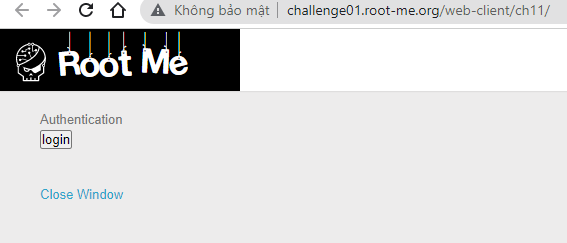
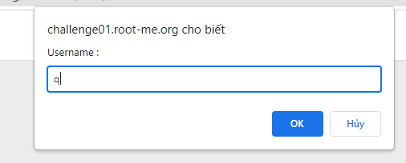
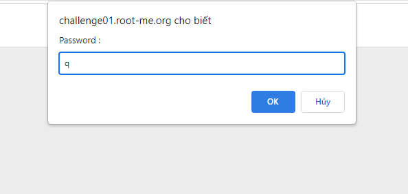
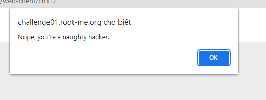
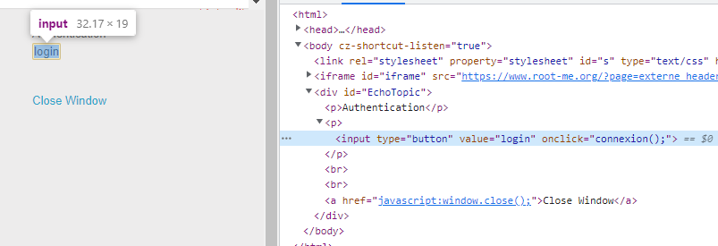
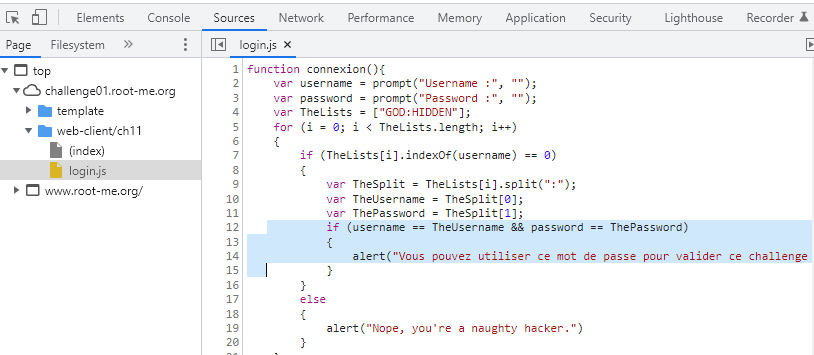
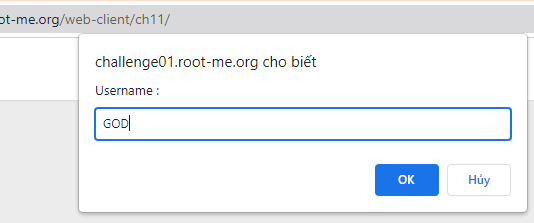
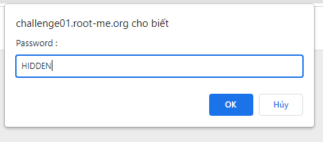
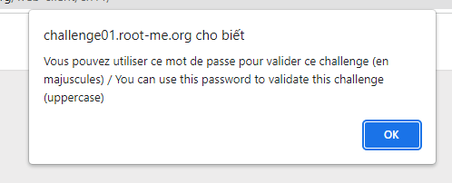
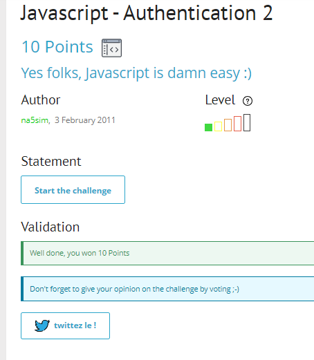

# Write up challenge Javascript - Authentication 2

Tác giả:
- **Nguyễn Mỹ Quỳnh**  

  
[Link Challenge](https://www.root-me.org/en/Challenges/Web-Client/Javascript-Authentication-2) 
 

 

Truy cập challenge ta thấy có một button login, nhấp vào yêu cầu nhập lần lượt username và password. Nhập thử thì thông báo sai hiện lên.

 
 
 
 

 

Tiến hành inspect, ta thấy button bắt sự kiên onclick và gọi hàm connexion().

 

 

Tiến hành xem source code file login.js.
 
Từ dòng 4 đến dòng 15, ta thấy username và password được so sánh với 2 biến TheUsername và ThePassword được tạo từ biến TheSplit `"GOD:HIDDEN"` và được phân chia bởi dấu `":"`

 

 
 

Tiến hành nhập username là `"GOD"` và password là `"HIDDEN"`, ta nhận được thông báo thành công 

 
 
 

 

Dùng password submit challenge. Thành công !

  

> **Flag:** HIDDEN