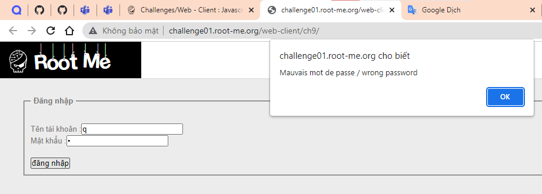
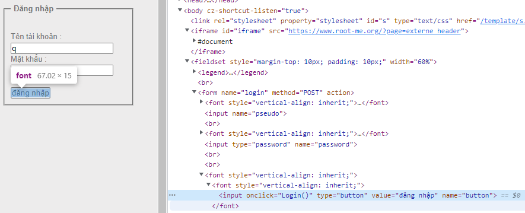
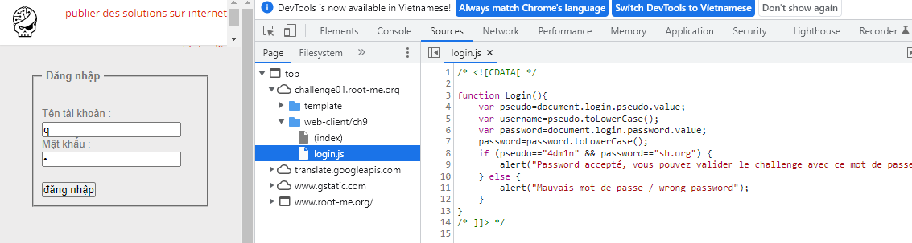
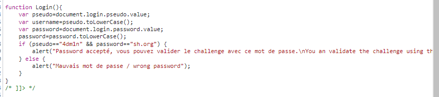
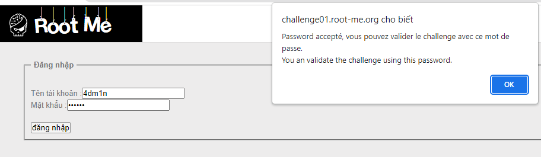
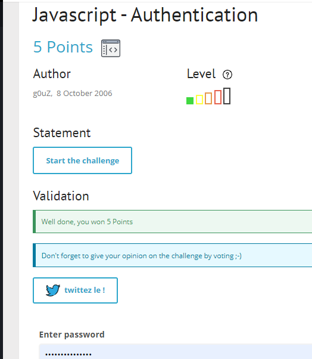

# Write up challenge Javascript - Authentication

Tác giả:
- **Nguyễn Mỹ Quỳnh**  

  
[Link Challenge](https://www.root-me.org/en/Challenges/Web-Client/Javascript-Authentication) 
 

 

Truy cập challenge ta thấy có một form đăng nhập, nhập thử thì thông báo sai hiện lên.

 

 

 

Tiến hành inspect, ta thấy button bắt sự kiên onclick và gọi hàm Login.

 

 

Tiến hành xem source code file login.js

 

 

Tại câu điều kiện if, ta thấy user được so sánh với `"4dm1n" `và password được so sánh với `"sh.org"`

 

 

Tiến hành nhập thử, ta nhận được thông báo thành công 

 

 

Dùng password `"sh.org"` submit challenge. Thành công !

  

> **Flag:** sh.org