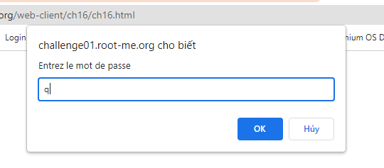
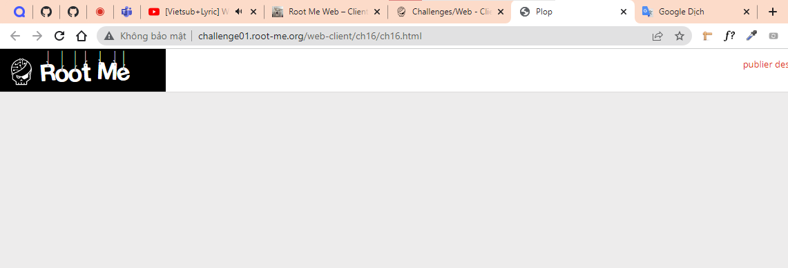
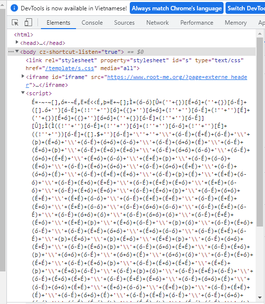
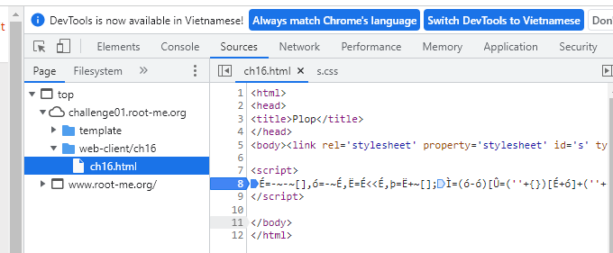
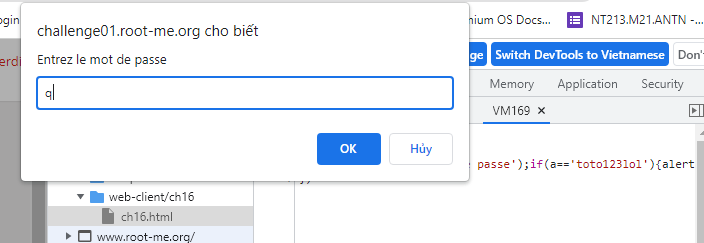
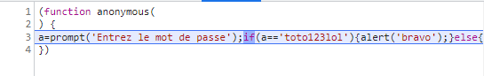
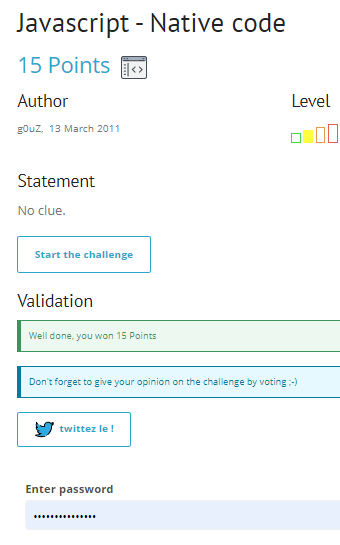

# Write up challenge Javascript - Native code

Tác giả:
- **Nguyễn Mỹ Quỳnh**  

  
[Link Challenge](https://www.root-me.org/en/Challenges/Web-Client/Javascript-Native-code) 
 

 

Truy cập challenge ta thấy có một form yêu cầu nhập password. Nhập thử thì không thấy hiện gì.

 

 

 

 

Inspect thử ta thấy có 1 đoạn script lạ không đọc được:

 

 

Tiến hành đặt breakpoint và debug sử dụng step into thử xem thực ra đoạn code này làm gì:

 

 

Step into liên tục cho đến khi form hiện lên yêu cầu nhập pass, nhập vào `"q"`

 

Xem biến ta thấy `"q"` ta vừa nhập được lưu vào a. Xem code tại thời điểm đó ta thấy a được so sánh với `"toto123lol"` nếu bằng thông báo `"bravo"`. Vậy `"toto123lol"` là pass cần tìm.

 

Dùng flag submit challenge. Thành công !

  

> **Flag:** toto123lol