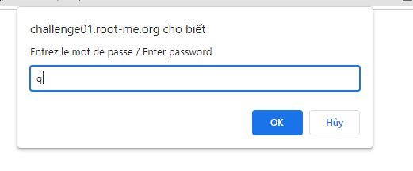
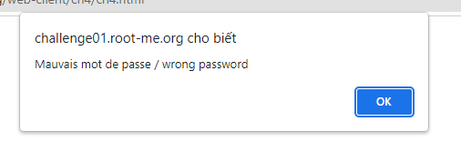
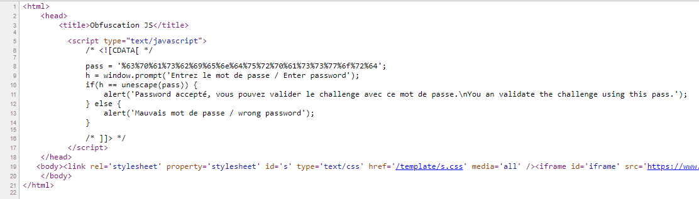
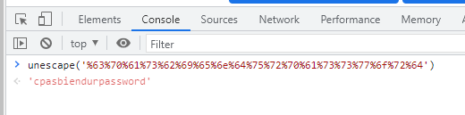
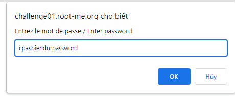
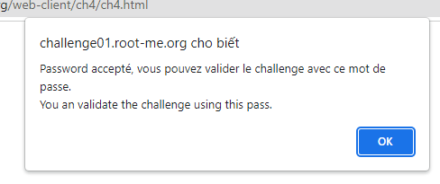
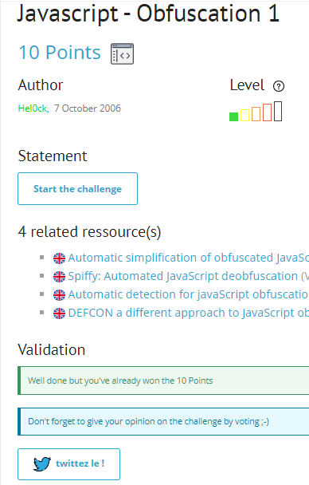

# Write up challenge Javascript - Obfuscation 1

Tác giả:
- **Nguyễn Mỹ Quỳnh**  

  
[Link Challenge](https://www.root-me.org/en/Challenges/Web-Client/Javascript-Obfuscation-1) 
 

 

Truy cập challenge ta thấy có một form yêu cầu nhập password. Nhập thử thì thông báo sai hiện lên.

 
 

 

Inspect không thu được thông tin gì nên ta thử Ctr + U xem source code trang 

 

 

 

Từ dòng 8 đến dòng 11, ta thấy password nhập vào được so sánh với `unescape(pass)` trong đó pass=`'%63%70%61%73%62%69%65%6e%64%75%72%70%61%73%73%77%6f%72%64'`

Sử dụng Console trong Developer Tools để unescape chuỗi trên để tìm ra password

 

 

Ta tìm được password là `"cpasbiendurpassword"`. Nhập thử và nhận được thông báo thành công

 

 

Dùng password submit challenge. Thành công !

  

> **Flag:** cpasbiendurpassword