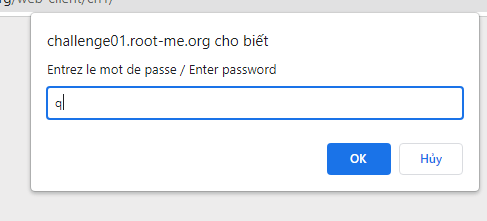
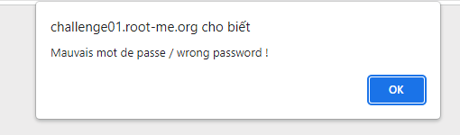
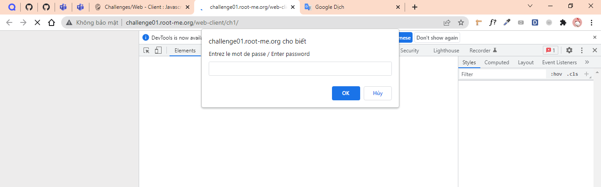
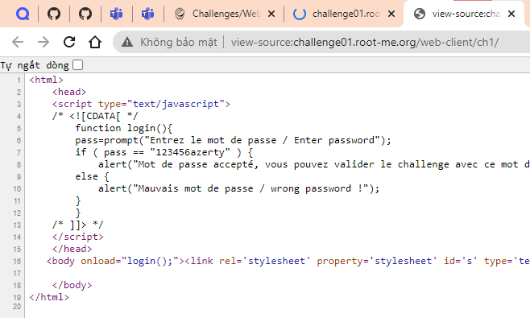
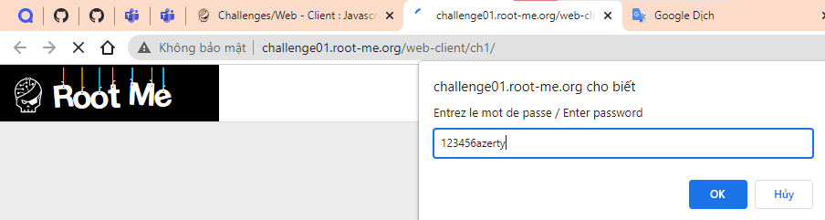
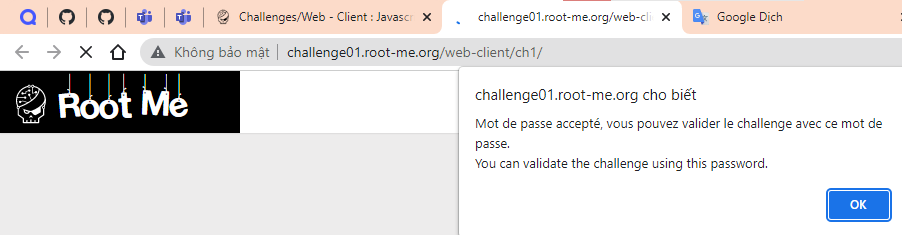
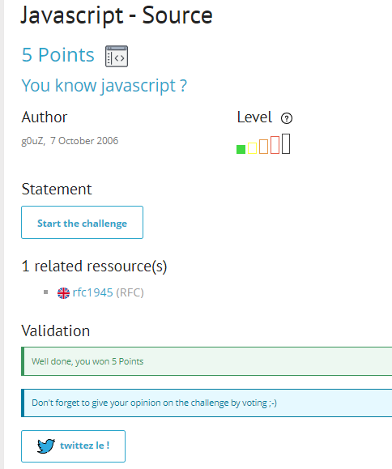

# Write up challenge Javascript - Source

Tác giả:
- **Nguyễn Mỹ Quỳnh**  

  
[Link Challenge](https://www.root-me.org/en/Challenges/Web-Client/Javascript-Source) 
 

 

Truy cập challenge ta thấy có một form yêu cầu nhập password, nhập thử thì thông báo sai hiện lên.

 

 

 

Tiến hành inspect không thu được thông tin gì 

 

 

 

Thử Ctr + U để xem source code của trang, ta thấy password được so sánh với `"123456azerty"` 

 

 

Tiến hành nhập thử, ta nhận được thông báo thành công 

 

 

Dùng password submit challenge. Thành công !

  

> **Flag:** 123456azerty