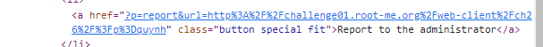

# Write up challenge XSS - Reflected

Tác giả:
- **Nguyễn Mỹ Quỳnh**  

[Link Challenge](https://www.root-me.org/en/Challenges/Web-Client/XSS-Reflected) 
 

Sau khi truy cập challenge ta thấy có một menu. Xem sơ các trang trong menu, ta chỉ thấy có trang contact là có form cho nhập input nhưng theo như ghi chú form sẽ không được check 

 

 

 

Inspect thì phát hiện có một trang Security đã bị ẩn. Tiến hành mở ra thử thì đó là trang 404

 

 

Ta thấy có một nút Report to the administrator, inspect thì có thể thấy được url khi nhấn report (dùng burpsuite decode cho dễ nhìn)

 

Ta thấy đấy chính là url hiện tại, thử sửa url và kiểm tra lại, ta thấy url gửi lên admin cũng thay đổi tương ứng

 

Mặt khác, khi thay đổi url thuộc tính href trong thẻ `<a>` cũng thay đổi. Có thể đây chính là lỗ hổng. 

 

Tuy nhiên khi chèn thử kiểm tra ta thấy nhiều kí tự html đã bị lọc, duy nhất 'không được lọc. Ta có thể lợi dụng điểm này để đóng thuộc tính href và chèn thêm thuộc tính khác.

 

Vì challenge đã có ghi chú là addmin sẽ không nhấp vào bất cứ liên kết nào, nên thuộc tính ta chọn có thể là `onmousemove`. 
 
Tiên hành chèn code khai thác

    q' onmouseover='document.write(%22%22))

 

Sau đó di chuột qua element thì ta thấy câu lệnh được thực thi 

 

Ta có được cookie của user 

 

Bây giờ tiến hành chèn lại code vào url và hấn nút report to the administrator để gửi url lên admin, đợi admin vào trang di chuột qua element và ta sẽ có được cookie:

 

Có được flag:

 

Submit thành công 

  

> **Flag:** r3fL3ct3D_XsS_fTw

