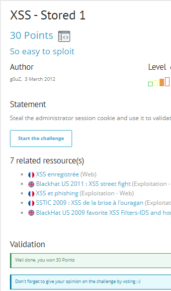

# Write up challenge XSS - Stored 1

Tác giả:
- **Nguyễn Mỹ Quỳnh**  

  
[Link Challenge](https://www.root-me.org/en/Challenges/Web-Client/XSS-Stored-1) 
 

 

Truy cập challenge ta thấy có một form gửi message.

 

 

  

Sau nhiều lần điền thử, gửi và refresh lại trang, em nhận thấy sau khi mình gửi message sẽ được lưu lại ở trang này và sau vài phút thì admin sẽ vào đọc tin nhắn.   

 

  

Tiến hành inspect ta thấy có vẻ input đã không được kiểm tra và được đặt thẳng vào reponse trả về 

 

 

Thử sử dụng phương pháp XSS stored, chèn vào câu lệnh javascript 

 

 

Thật vậy có lỗ hổng!

 

Những gì cần làm sẽ là lợi dụng lỗ hổng này để chèn đoạn script lưu trữ để khi admin truy cập vào check tin nhắn thì cookie của admin sẽ được gửi đến endpoint mà mình chỉ định.

  Sử dụng trang https://requestinspector.com/ để tạo endpoint và check request gửi đến. 
 
Tiến hành chèn script:

    

Nhận được request chứa cookie của user

 

Việc còn lại chỉ cần đợi admin vào đọc message và ta sẽ có được cookie:

Submit thành công 

  

> **Flag:** NkI9qe4cdLIO2P7MIsWS8ofD6

