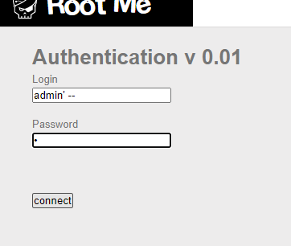
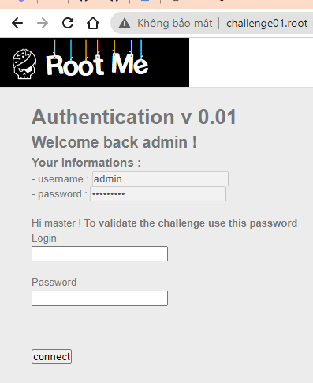
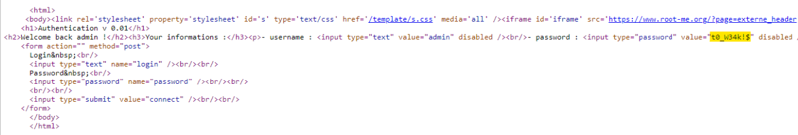
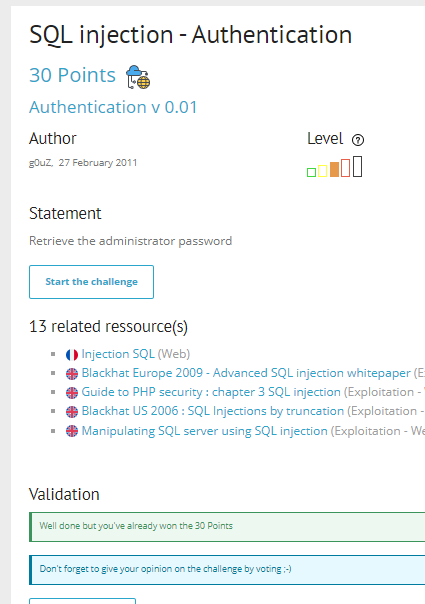

# Write up challenge SQL injection - Authentication

Tác giả:
- **Nguyễn Mỹ Quỳnh**  

  
[Link Challenge](https://www.root-me.org/en/Challenges/Web-Server/SQL-injection-authentication) 
 

Truy cập challenge ta thấy có một form login.
Thử tiến hành một sqli basic attack

 

Thành công đăng nhập dưới quyền admin

Tat thấy có một form information chứa password bị hide, tiến hành inspect xem thử ta có được flag:

Submit thành công 

  

> **Flag:** t0_W34k!$
