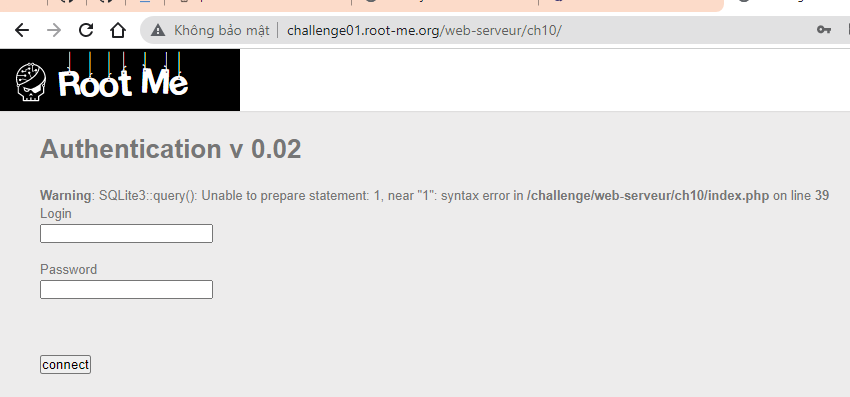
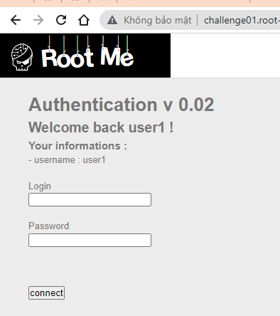
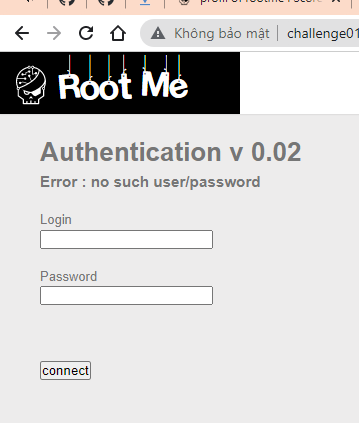
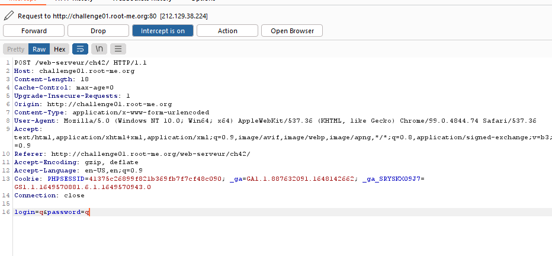
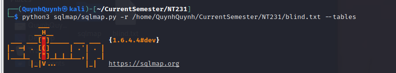
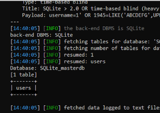
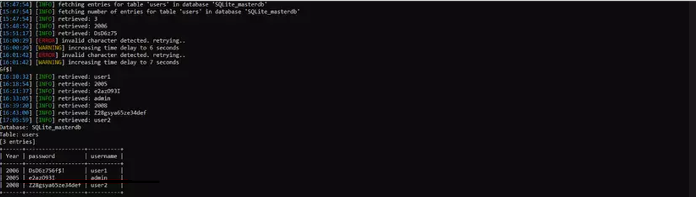
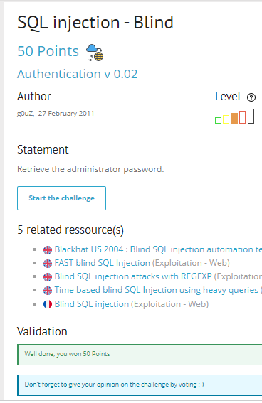

# Write up challenge SQL injection - Blind

Tác giả:
- **Nguyễn Mỹ Quỳnh**  

  
[Link Challenge](https://www.root-me.org/en/Challenges/Web-Server/SQL-injection-blind) 
 

Truy cập challenge ta thấy bài này là một bài blind sqli. Tên chaallenge cũng như thực hiện các bước kiểm tra đơn giản giản ta cũng đã thấy điều đó 

 

 

Bài này sử dụng phương thức POST nên ta sẽ dùng burpsuite

Lưu request vào file và kết hợp dùng sqlmap. Khai thác tên bảng `python3 sqlmap/sqlmap.py -r /home/QuynhQuynh/CurrentSemester/NT231/blind.txt --tables  `

Kết quả trả về 1 bảng là users. Thực hiện khhai thascduwx liệu bảng `python3 sqlmap/sqlmap.py -r /home/QuynhQuynh/CurrentSemester/NT231/blind.txt -T users --dump`

Có được flag. Submit thành công 

  

> **Flag:** e2azO93i

