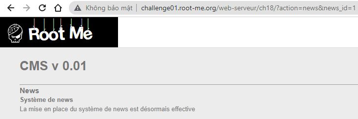
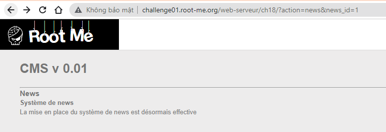
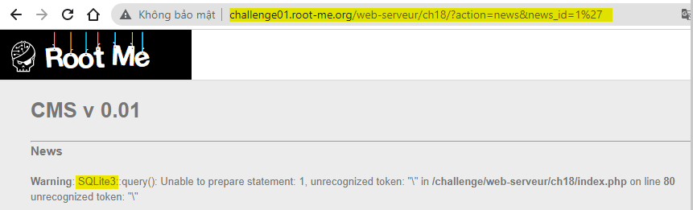
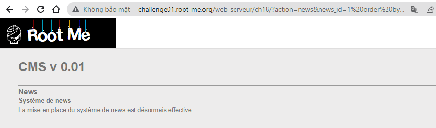
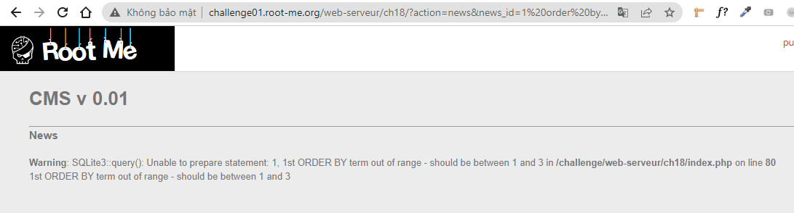
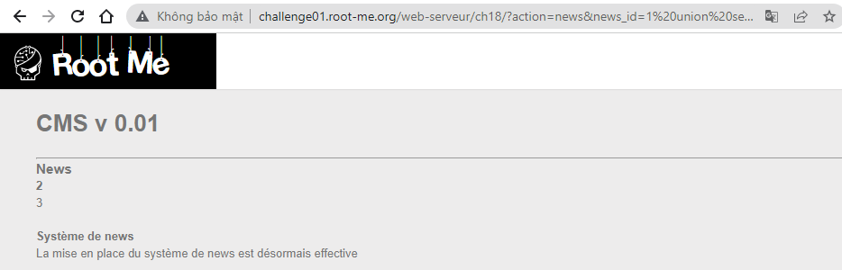
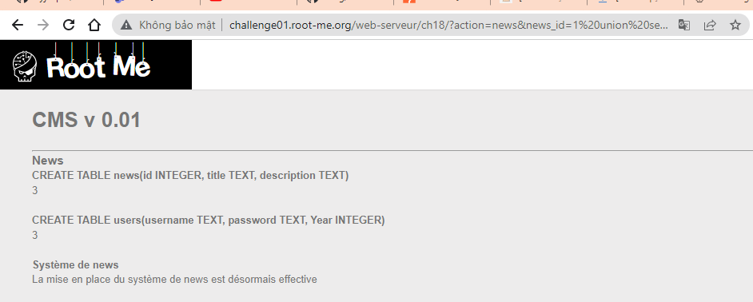
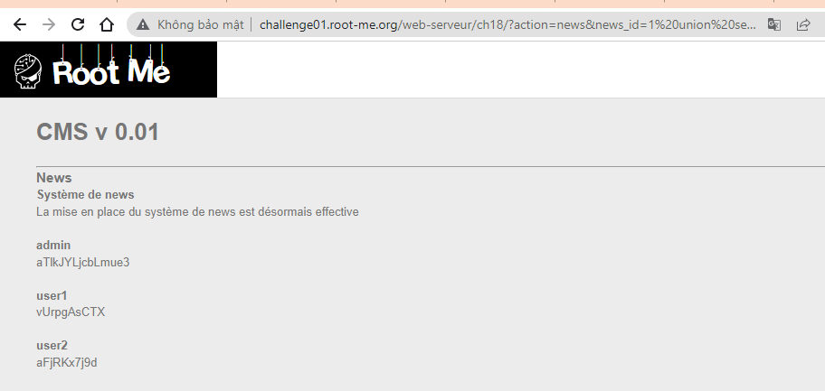
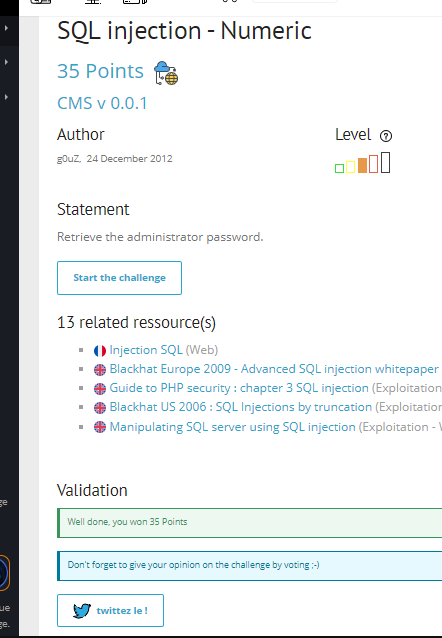

# Write up challenge SQL injection - Numeric

Tác giả:
- **Nguyễn Mỹ Quỳnh**  

  
[Link Challenge](https://www.root-me.org/en/Challenges/Web-Server/SQL-injection-Numeric) 
 

Truy cập challenge ta thấy gồm 2 trang Login và Accueil. 

 

Tiến hành attack thử trang Système de news trong Accueil. Thêm ký tự `'` vào sau số 1 thì ta phát hiện lỗi SQL injection 

 

 

Vậy là ta đã biết trang này sử dụng database là SQLite3.
  Đầu tiên sử dụng lệnh: `1’ order by 1--` để kiểm tra số cột cho phép. Nhưng sau khi thử và thực hiện tiếp thì không có kết quả gì và tên bài này cũng là Numeric nên có vẻ dường như ký tự `'` không cần được sử dụng để ngắt chuỗi. 
Thử lại với  `1 order by 1--`

Đến `1 order by 4--` thì bị lỗi 

Vậy là database này có 3 cột. Tiếp theo kiểm tra xem cột nào có thể khai thác. Gõ lệnh: 1 union select 1,2,3--

Ta thấy có thể khai thác tại cột thứ 2 và 3. Tiến hành lấy tên table trong SQLite3 `1 union select 1,sql,3 FROM sqlite_master--` 

Lấy giá trị từ table users `1 union select 1,username,password FROM users--`. Có được pass admin:

Submit thành công 

  

> **Flag:** aTlkJYLjcbLmue3
