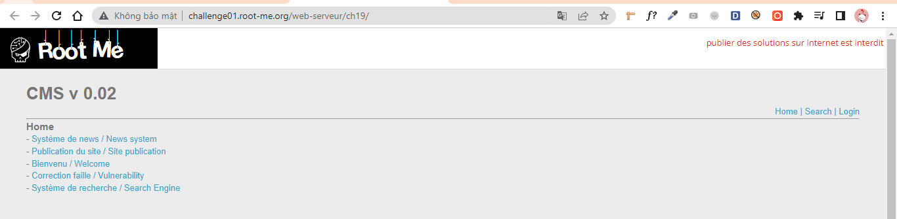
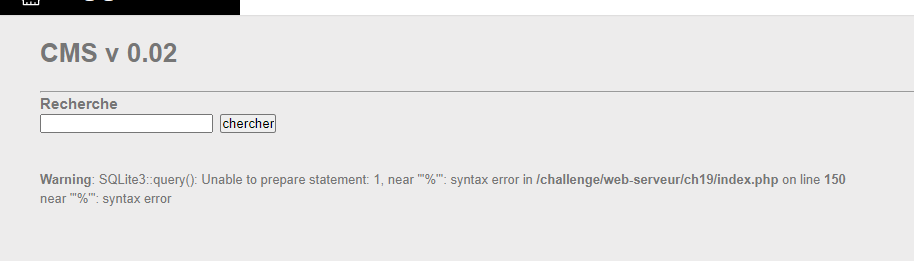
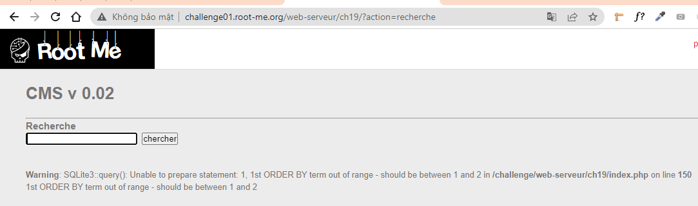
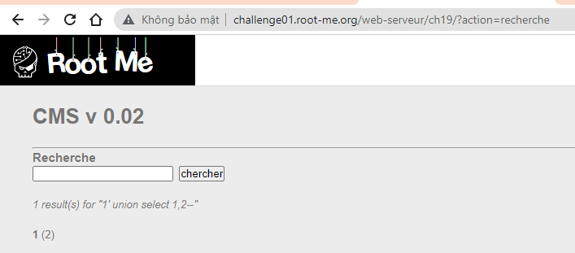
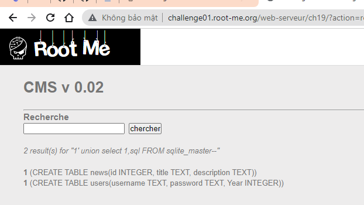
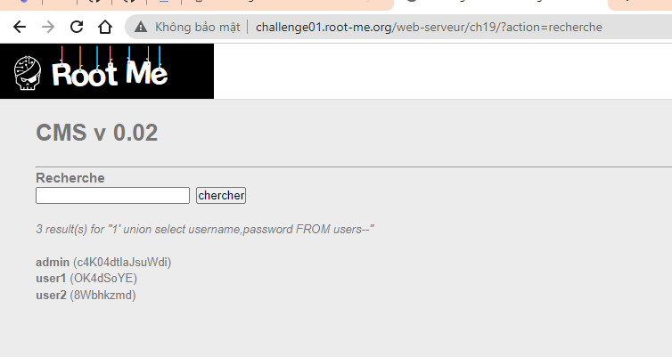
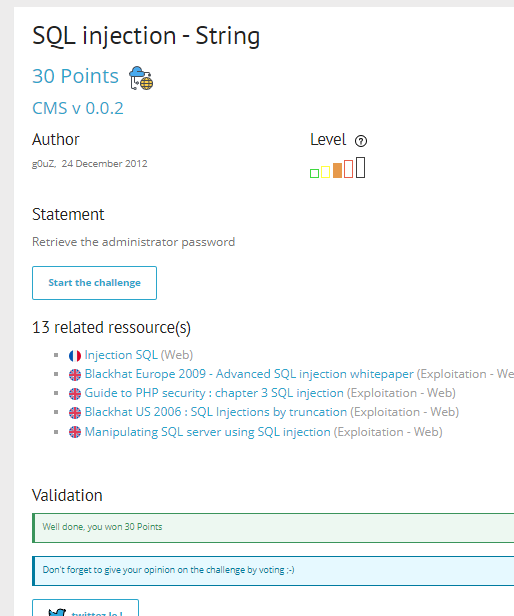

# Write up challenge SQL injection - String

Tác giả:
- **Nguyễn Mỹ Quỳnh**  

  
[Link Challenge](https://www.root-me.org/en/Challenges/Web-Server/SQL-injection-String) 

Truy cập challenge ta thấy gồm 3 trang Home | Search | Login

 

  Sau khi test bằng cách nhập `1'` vào ô Recherche trong trang Search em thấy rằng lỗi SQL injection 
 xuất hiện tại đây

 

Vậy là ta đã biết trang này sử dụng database là SQLite3.
  Đầu tiên sử dụng lệnh: `1' order by 1--` để kiểm tra số cột cho phép. 

Tăng dần lên đến `1' order by 3--` thì bị lỗi 

Vậy là database này có 2 cột. Tiếp theo kiểm tra xem cột nào có thể khai thác. Gõ lệnh: `1' union select 1,2--`

Ta thấy có thể khai thác ở cả hai cột. Tiến hành lấy tên table trong SQLite3 `1' union select 1,sql FROM sqlite_master--` 

Lấy giá trị từ table users `1' union select username,password FROM users--`. Có được pass admin:

Submit thành công 

  

> **Flag:** c4K04dtIaJsuWdi
