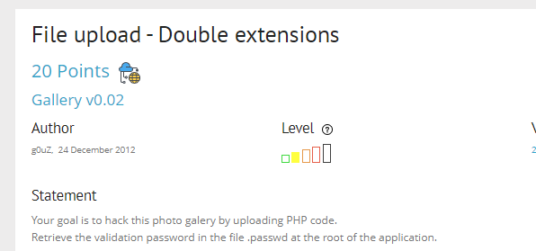
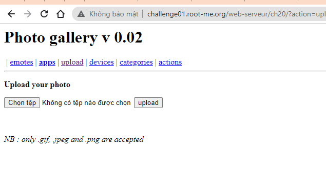
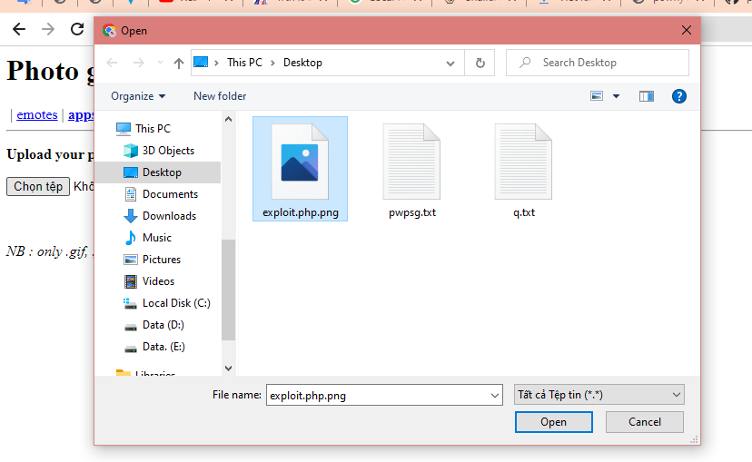
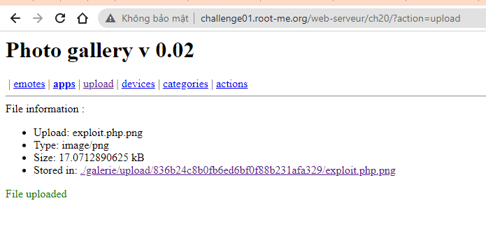
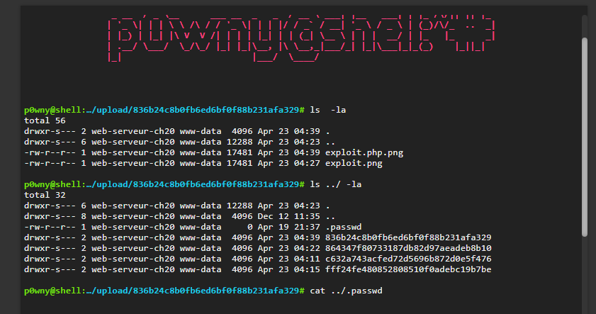
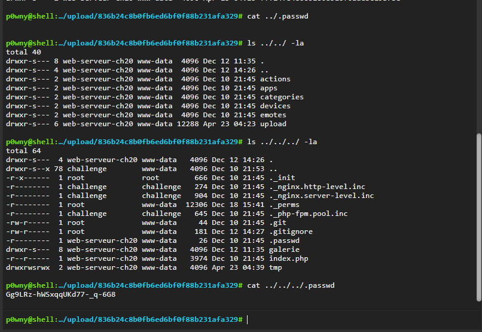
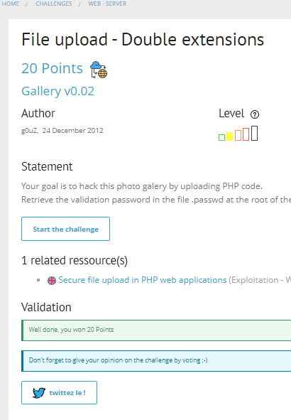

# Write up challenge File upload - Double extensions

Tác giả:
- **Nguyễn Mỹ Quỳnh**  

  
[Link Challenge](https://www.root-me.org/en/Challenges/Web-Server/File-upload-Double-extensions) 
 

Truy cập challenge ta thấy đây là hint của challenge:

Tiến hành làm theo hint.

- Hint 1: Mục tiêu của bạn là hack thư viện ảnh này bằng cách tải lên mã PHP. Từ đây ta chú ý đến mục upload. Vào xem thử thì thấy challange chỉ cho upload các file với extensions là `.gif`, `.jpeg` và `.png`. 

- Hint 2: Truy xuất mật khẩu xác thực trong tệp .passwd ở thư mục gốc của ứng dụng. Kết hợp cả 2 hint ta sẽ có hướng đi như sau: tiến hành upload file shell php với tên là `exploit.php.png` để tương tác và tìm tệp .passwd.

Ok làm thôi! Sau khi search mạng mình sẽ sử dụng shell php tại link sau: 
    https://github.com/flozz/p0wny-shell/blob/master/shell.php

Tiến hành đổi đuôi file như đã phân tích phía trên và upload.

Nhấp vào đường dẫn lưu trữ file, ta thành công có được shell.

Việc tiếp theo là dùng lệnh `ls -la` tìm kiếm trong các thư mục file .passwrd. 
Tiến hành back ra dần thư mục phía trước:

Cat file .passwrd đã tìm được và có được flag.

Submit thành công!

  

> **Flag:** Gg9LRz-hWSxqqUKd77-_q-6G8

