# Write up challenge File upload - MIME type

Tác giả:
- **Nguyễn Mỹ Quỳnh**  

[Link Challenge](https://www.root-me.org/en/Challenges/Web-Server/File-upload-MIME-type) 
 

Truy cập challenge ta thấy đây là hint của challenge:

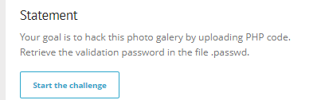

Tiến hành làm theo hint.

- Hint 1: Mục tiêu của bạn là hack thư viện ảnh này bằng cách tải lên mã PHP. Từ đây ta chú ý đến mục upload. Vào xem thử thì thấy challange chỉ cho upload các file với extensions là `.gif`, `.jpeg` và `.png`. 

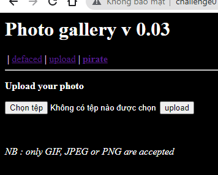

- Hint 2: Truy xuất mật khẩu xác thực trong tệp .passwd ở thư mục gốc của ứng dụng. Kết hợp cả 2 hint ta sẽ có hướng đi như sau: tiến hành upload file shell php với để tương tác và tìm tệp .passwd.

Bài này khá tương tự bài Double extensions chỉ khác ở chỗ là không thể bypass bằng Double extensions nữa, mà bài này có cơ chế kiểm tra qua  Content-Type.

Sau khi search mạng mình sẽ sử dụng shell php tại link sau: 
    https://github.com/flozz/p0wny-shell/blob/master/shell.php

Bắt gói tin Burpsuite kiểm tra thì thấy `Content-Type` được set là `image/png` vì vậy khi up file với đuôi `.jpg` thì sẽ upload thành công tuy nhiên sẽ không nhận dạng và thực thi được file php để get shell. 

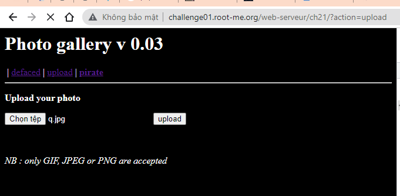

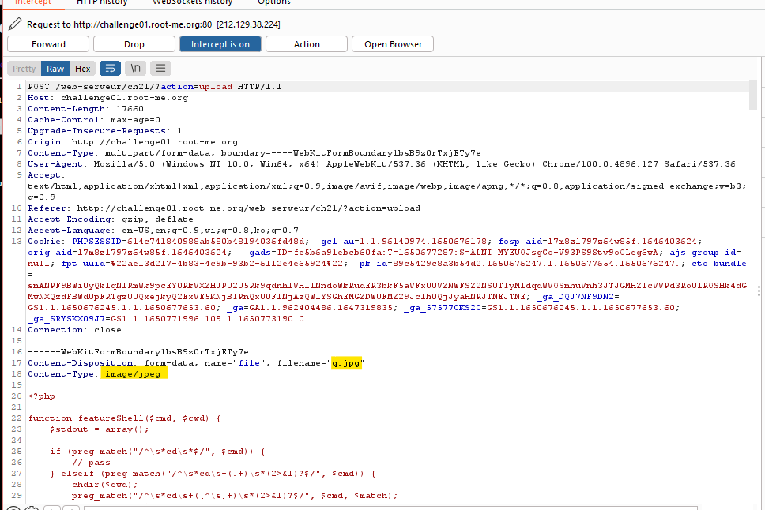

 

Thử up với đuôi `.php` thì upload không thành công. 

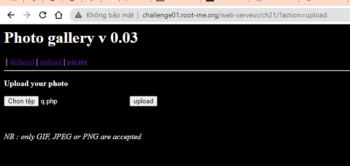

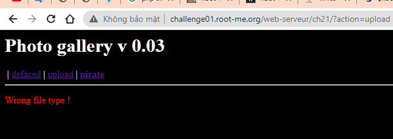

 

Bắt gói tin Burpsuite kiểm tra thì thấy `Content-Type` được set là `application/octet-stream`. Đó là nguyên nhân không upload được! 

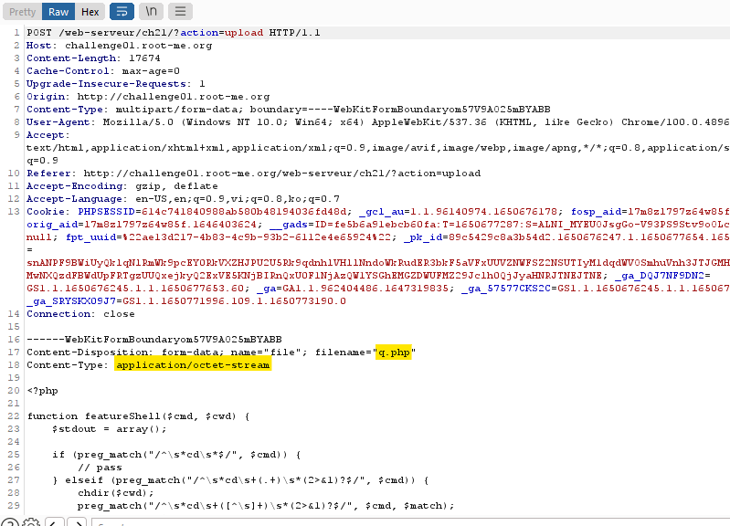

OK vậy bây giờ chỉ cần sửa `Content-Type` thành `image/png` là được.

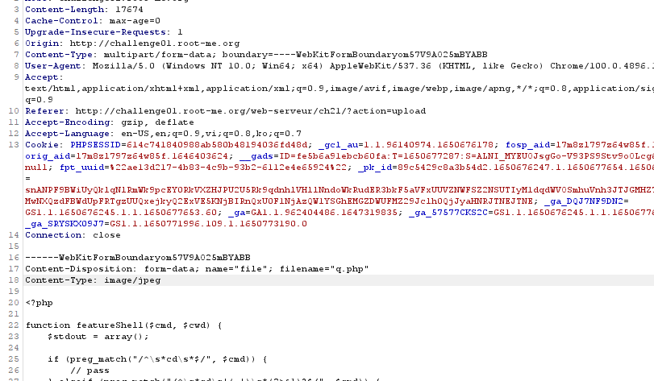

Upload thành công.
Tiến hành nhấp vào file php vừa upload được ta sẽ có được shell.

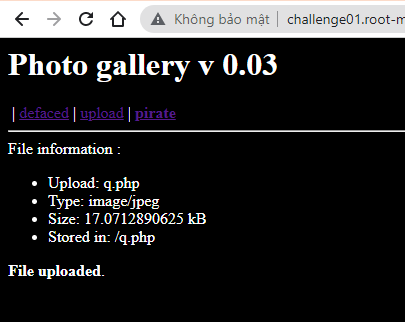

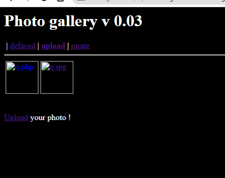

Việc tiếp theo là dùng lệnh `ls -la` tìm kiếm trong các thư mục file .passwrd. 
Tiến hành back ra dần thư mục phía trước:

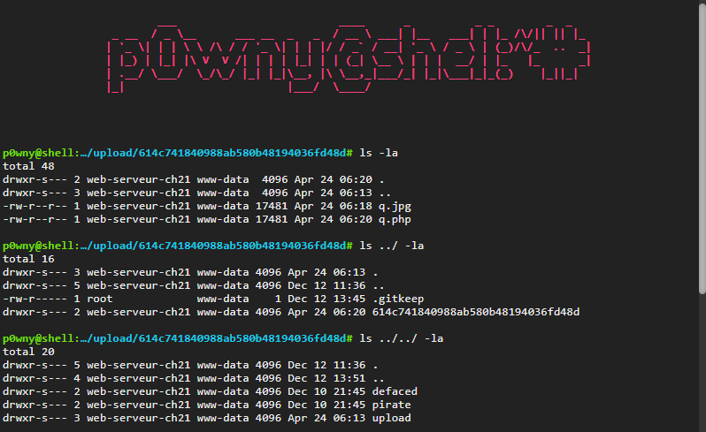

Cat file .passwrd đã tìm được và có được flag.

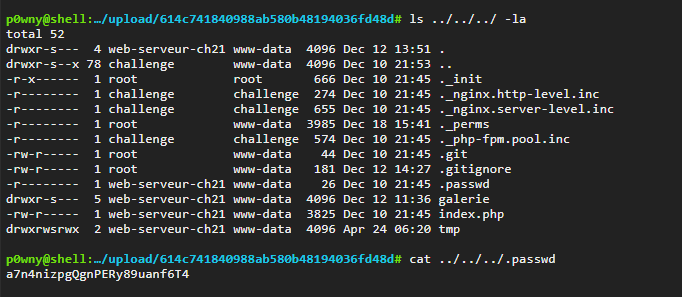

Submit thành công!

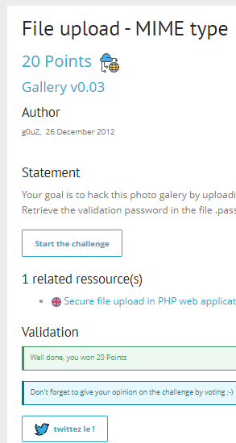

  

> **Flag:** a7n4nizpgQgnPERy89uanf6T4

