# Write up challenge Local File Inclusion - Wrappers

Tác giả:
- **Nguyễn Mỹ Quỳnh**  

  
[Link Challenge](https://www.root-me.org/en/Challenges/Web-Server/Local-File-Inclusion-Wrappers) 
 

Truy cập challenge ta thấy có chỗ upload file. Upload thử 1 file 

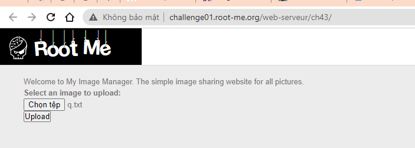 

Ta thấy chỉ file .jpg được chấp nhận. Ý tưởng là ta sẽ upload file shell lên để từ đó tương tác tìm password.

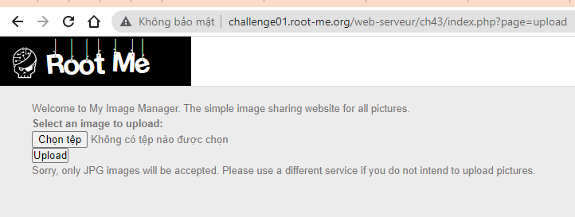 

  Challenge không có thêm hint gì cả. Để ý đến tên challenge và tiến hành đi tìm hiểu về Wrappers thì ta có được cách triển khai như sau:

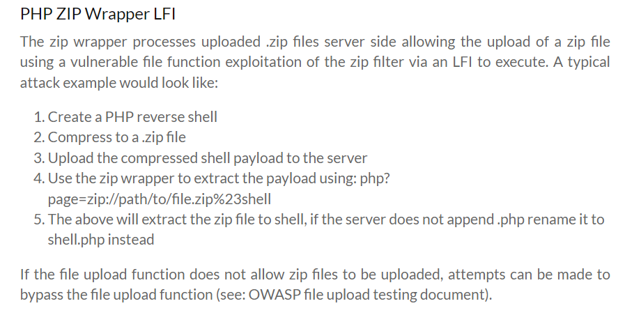

 

OK, tiến hành làm theo thử:
- Tạo 1 file shell có extension là .php, sử dụng shell php tại link sau: https://github.com/flozz/p0wny-shell/blob/master/shell.php. Sau đó, nén file đó vào 1 cái zip. Nhưng vì chỉ file .jpg được chấp nhận nên ta sẽ đổi đuôi file .zip thành .jpg.

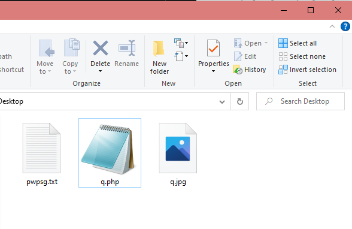

 

- Up file zip này lên. Ta thấy browser render lên một image. Inspect ta thấy được đường dẫn đến file .jpg vừa up.
 Tiến hành giải nén ra shell  thông qua payload url: `?page=zip://<pathToZipFile>%23<shellFileName>`
(Không cần thêm đuôi .php vào cuối cùng vì server sẽ mặc định đuôi file đó là .php)

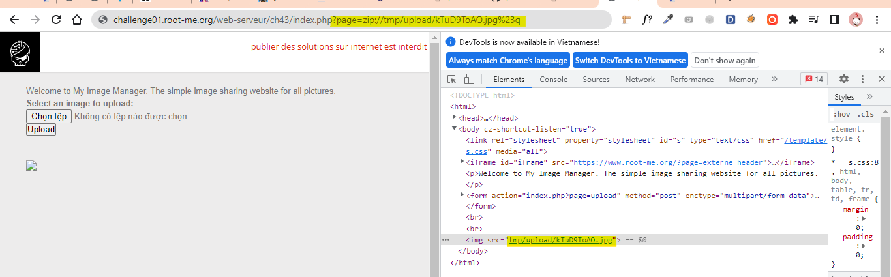

 

Tuy nhiên không tương tác được, dường như các vì các hàm system(), shell_exec() bị chặn.

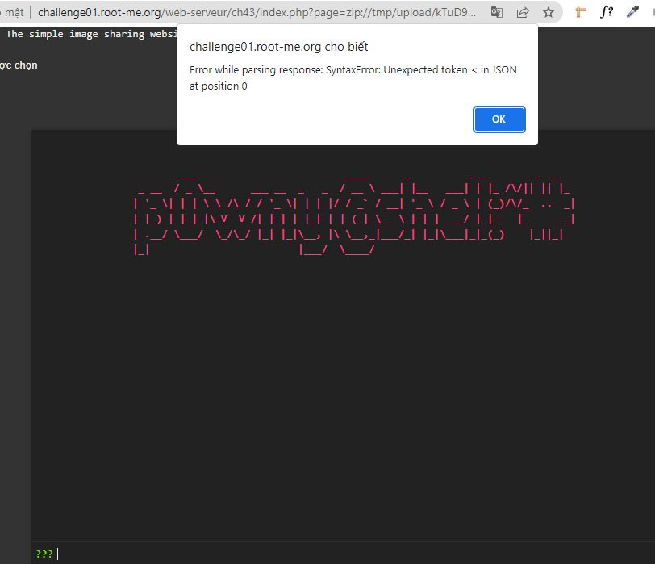

Ok ta sẽ tự viết một shell php. Mục đích cần tìm được file flag, sau khi search google cũng như thử nhiều lần thì em hát hiện hàm scandir() không bị filter. Ta sẽ dùng hàm này để list tất cả các folder/file trong thư mục. 

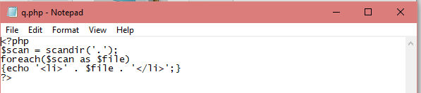

Sau đó thực hiện các bước up file và truy cập đường dẫn như đã phân tích bên trên ta tìm được file flag.

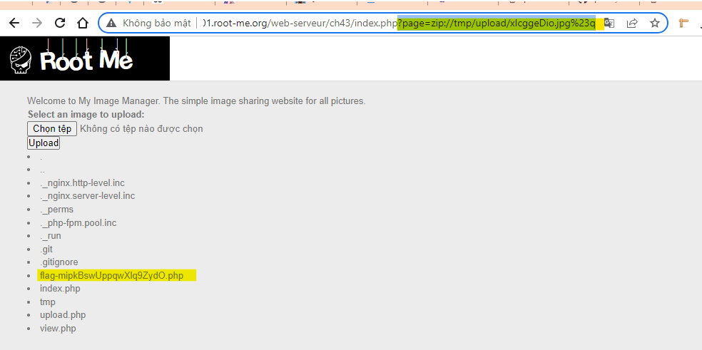

Tiến hành sửa file q.php để get nội dung file flag. 

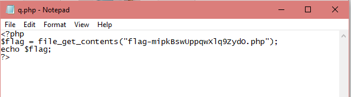

Upload lại và ta tìm được flag!

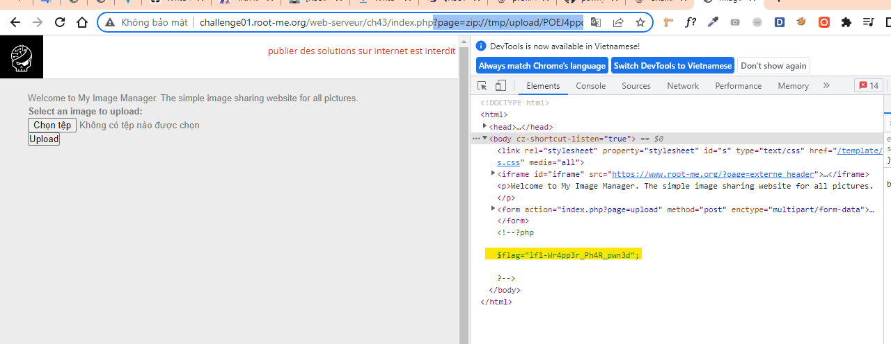

Submit thành công!

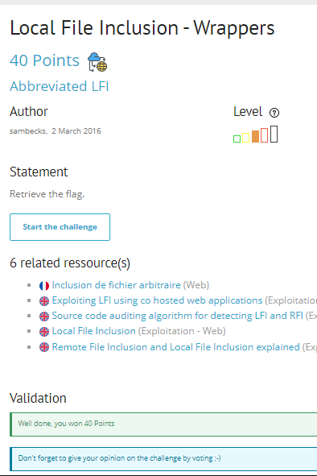

  

> **Flag:** lf1-Wr4pp3r_Ph4R_pwn3d