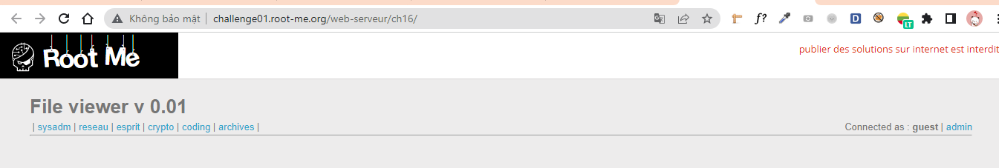
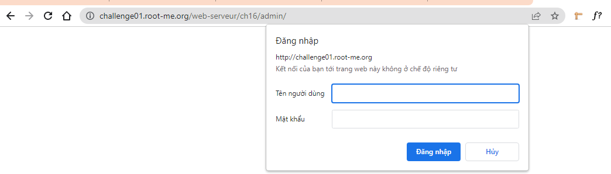
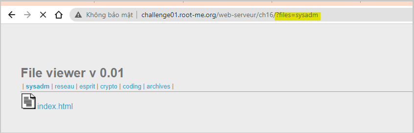
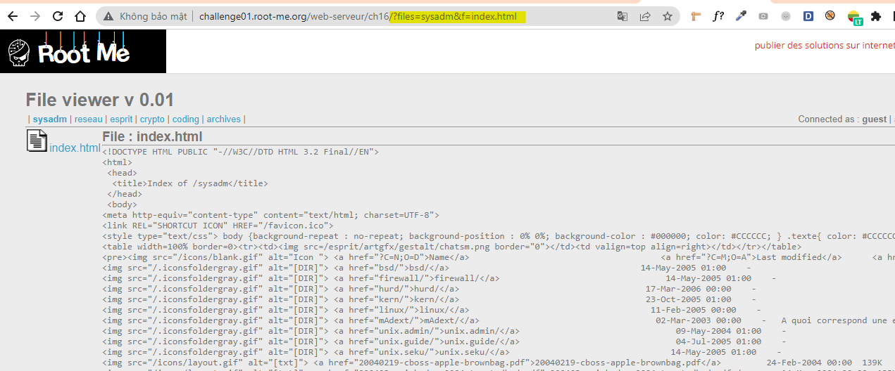
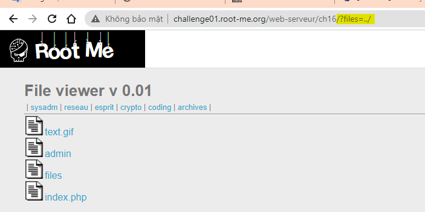
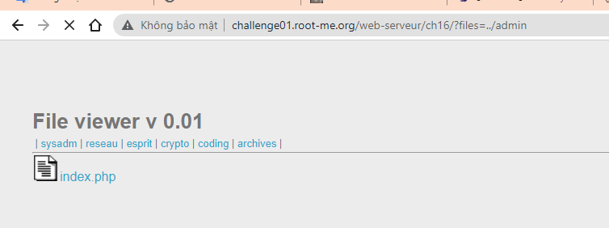
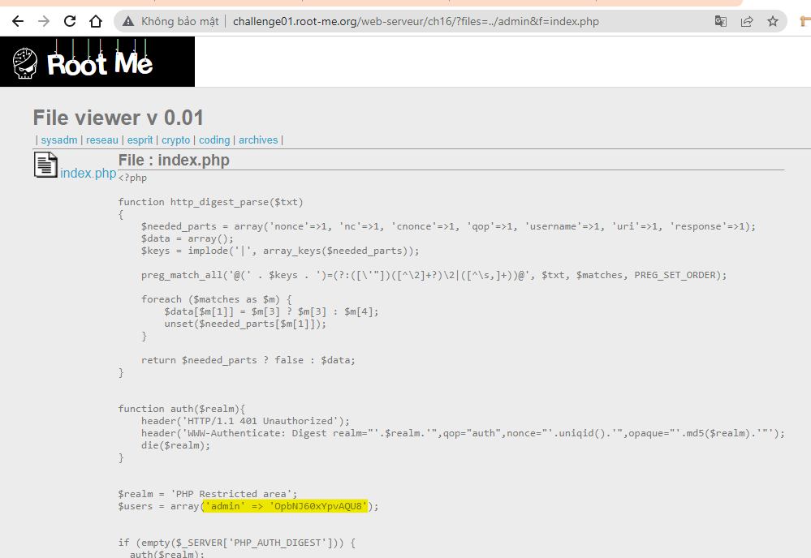
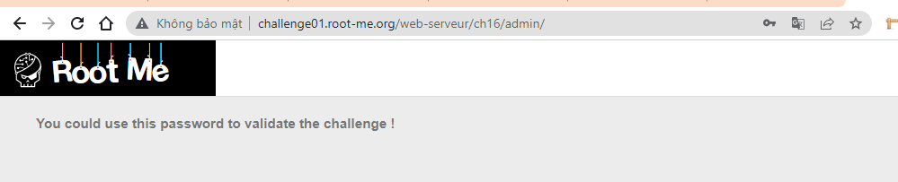
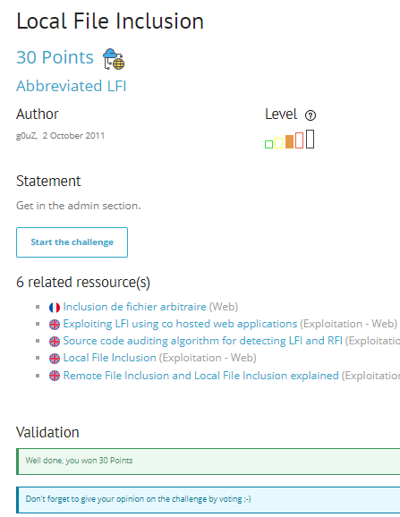

# Write up challenge Local File Inclusion

Tác giả:
- **Nguyễn Mỹ Quỳnh**  

  
[Link Challenge](https://www.root-me.org/en/Challenges/Web-Server/Local-File-Inclusion) 
 

Truy cập challenge ta thấy có 6 tab  | sysadm | reseau | esprit | crypto | coding | archives |.

Bên phải có link admin nhấp vào thì yêu cầu user và pass!

Bấm chọn từng tab thử thì ta thấy tương ứng với từng tab là thư mục chứa các file, đồng thời ta thấy url thay đổi, có thêm tham số `?files=sysadm`

Tiếp tục chọn file thì url có thêm tham số `?files=sysadm&f=index.html`. Từ đó ta có thể thấy tham số trên URL: `?files=sysadm&f=index.html`:
- files: tên thư mục
- f: tên file trong thư mục

Tiến hành thử một attack đơn giản: `http://challenge01.root-me.org/web-serveur/ch16/?files=../`
  Thật vậy, có lỗi Local File Inclusion!

Ta thấy thư mục admin, vào xem thử: `http://challenge01.root-me.org/web-serveur/ch16/?files=../admin`

Có file index.php. Ta Tiến hành nhấp vào xem source code, url tương ứng `http://challenge01.root-me.org/web-serveur/ch16/?files=../admin&f=index.php` thấy được user và password admin.

Dùng user và pass vừa tìm được truy cập vào link admin bên phải thì thành công.

Submit flag! 

  

> **Flag:** OpbNJ60xYpvAQU8
