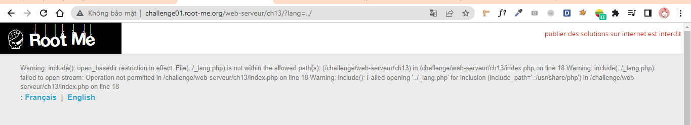
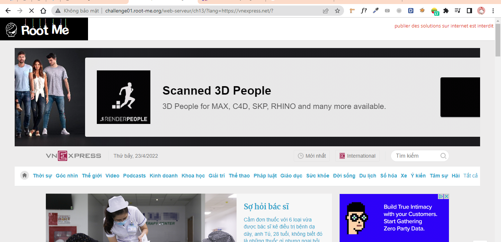
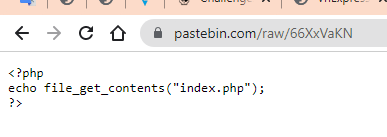
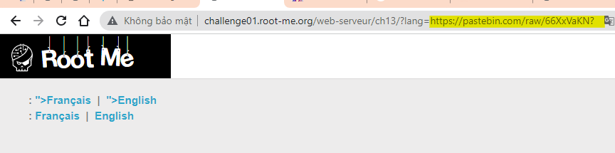
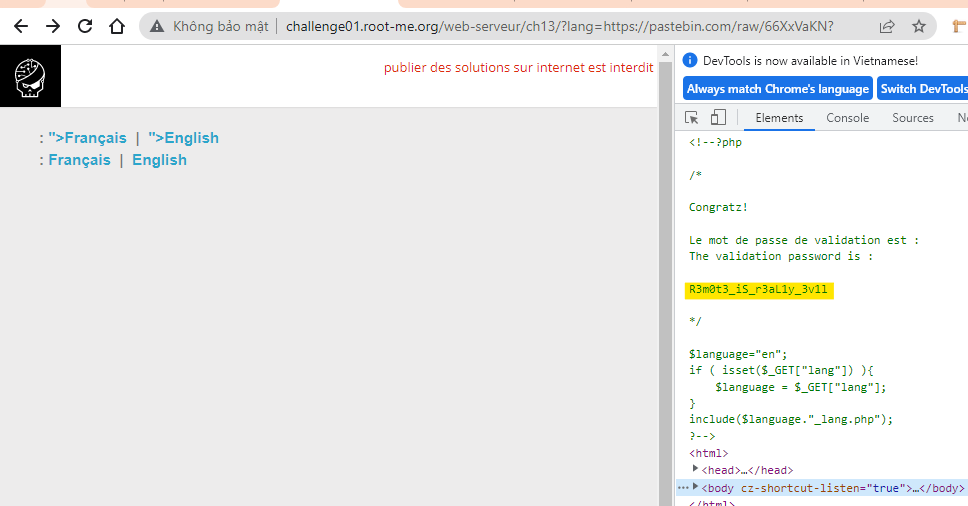
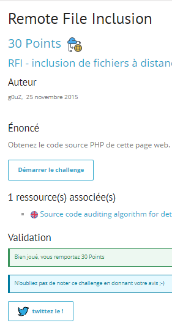

# Write up challenge Remote File Inclusion

Tác giả:
- **Nguyễn Mỹ Quỳnh**  

  
[Link Challenge](https://www.root-me.org/en/Challenges/Web-Server/Remote-File-Inclusion) 
 

Yêu cầu của challenge 

Thử một giá trị khác cho tham số `lang`. Ta thấy code sử dụng hàm `include()` và nối thêm `_lang.php` vào phía sau.

Dựa vào tên challenge ta thực hiện khai thác RFI. Thử include 1 file từ website khác:

        http://challenge01.root-me.org/web-serveur/ch13/?lang=https://vnexpress.net/?

Thành công! Ok bây giờ ta sẽ viết 1 đoạn code đơn giản từ trang https://pastebin.com/ để get nội dung file index.php:

      

Copy đường dẫn past vào và xem kết quả. Có một chút thay đổi là 2 trang Français | English xuất hiện 2 lần.

      

Inspect xem thử ta thấy flag:

      

Có được flag. Submit thành công 

  

> **Flag:** R3m0t3_iS_r3aL1y_3v1l

