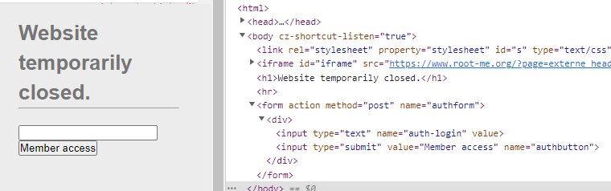

# Write up challenge HTML - disabled buttons

Tác giả:
- **Nguyễn Mỹ Quỳnh**  

  
[Link Challenge](https://www.root-me.org/en/Challenges/Web-Client/HTML-disabled-buttons) 
 

 

Truy cập challenge ta thấy có một ô input và nút  nhưng bị disable.

 

 

Tiến hành inspect 

 

 

 

Nhận thấy có 2 tag bị disable, tiến hành xóa thuộc tính disable

 

 

Nhập thử input, ta tìm được flag

 

 

Submit thử và thành công !

  

> **Flag:** HTMLCantStopYou

