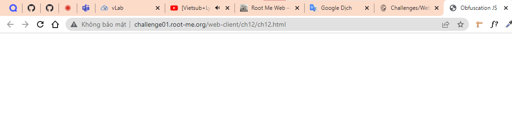
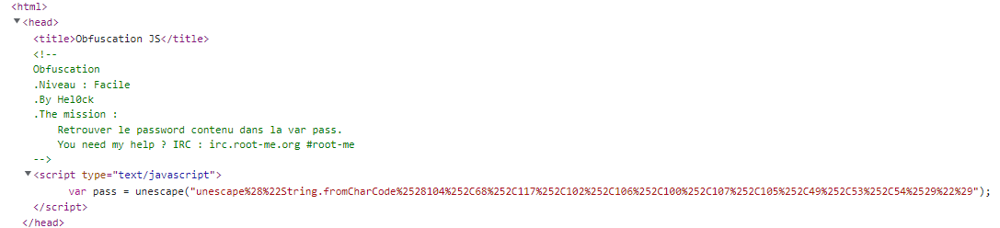
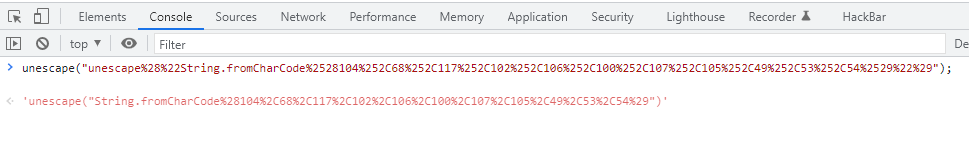
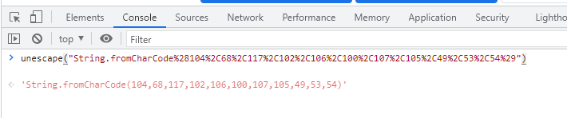
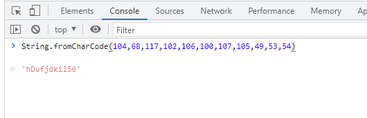
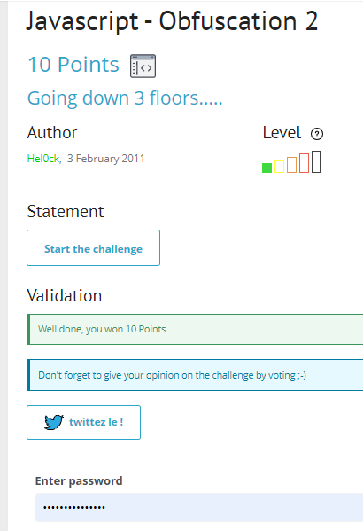

# Write up challenge Javascript - Obfuscation 2

Tác giả:
- **Nguyễn Mỹ Quỳnh**  

  
[Link Challenge](https://www.root-me.org/en/Challenges/Web-Client/Javascript-Obfuscation-2) 
 

 

Truy cập challenge ta thấy một trang trống.

 

 

Tiến hành inspect thử, ta thấy có một biến `pass` được gán bằng `unescape("unescape%28%22String.fromCharCode%2528104%252C68%252C117%252C102%252C106%252C100%252C107%252C105%252C49%252C53%252C54%2529%22%29");`

 

 
 
 

Sử dụng Console trong Developer Tools để unescape chuỗi trên

 

 

 

Tiếp tục unescape 

 

 

Tiếp tục thực thi chuỗi vừa thu được, ta thu được một chuỗi kí tự có vẻ như pass là `"hDufjdki156"`

 

 

Dùng chuỗi đó submit challenge. Thành công !

  

> **Flag:** hDufjdki156