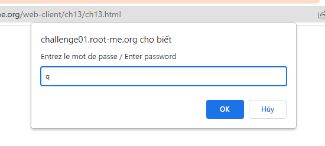
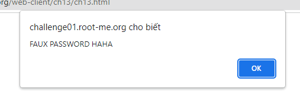
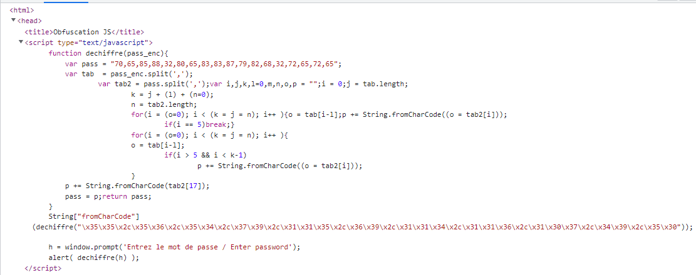
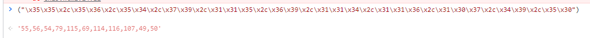
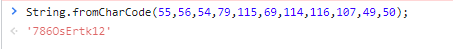
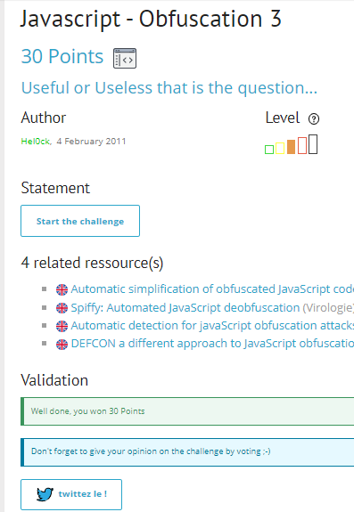

# Write up challenge Javascript - Obfuscation 3

Tác giả:
- **Nguyễn Mỹ Quỳnh**  

  
[Link Challenge](https://www.root-me.org/en/Challenges/Web-Client/Javascript-Obfuscation-3) 
 

 

Truy cập challenge ta thấy có một form yêu cầu nhập password. Nhập thử thì thông báo `FAUX PASSWORD HAHA` hiện lên.

 
 

 

Tiến hành inspect, ta thấy có một hàm `dechiffre` thực hiện các phép tính toán dài dòng. Xem sơ hàm thì có thể thấy có vẻ đầu vào không ảnh hưởng đến kết quả trả về của hàm cho lắm!

 

 

Thử xem xét các manh mối khác. Có một chuỗi Hex liên tiếp và ta thấy có một hàm trong javascript được gợi ý đó là  String.fromCharCode() 

    String["fromCharCode"](dechiffre("\x35\x35\x2c\x35\x36\x2c\x35\x34\x2c\x37\x39\x2c\x31\x31\x35\x2c\x36\x39\x2c\x31\x31\x34\x2c\x31\x31\x36\x2c\x31\x30\x37\x2c\x34
    \x39\x2c\x35\x30"));

Tiến hành convert chuỗi Hex đó:

 

 

Sử dụng hàm String.fromCharCode() với kết quả convert thu được, ta nhận được một chuỗi suy đoán đó là flag.

 

Thử submit challenge. Thành công !

  

> **Flag:** 786OsErtk12