# Write up challenge Javascript - Obfuscation 4

Tác giả:
- **Nguyễn Mỹ Quỳnh** <br>

  
[Link Challenge](https://www.root-me.org/en/Challenges/Web-Client/Javascript-Obfuscation-4)<br>
</br>

Truy cập challenge ta thấy có một form yêu cầu nhập password. Nhập thử thì thông báo sai hiện lên.

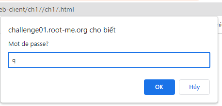 
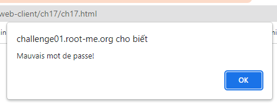 


<br>

Inspect thử ta thấy có một đoạn scipt dài, dùng VScode format lại ta có nội dung như sau:

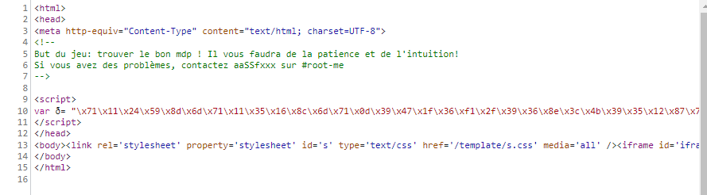 

<br>

        var ð =
        '\x71\x11\x24\x59\x8d\x6d\x71\x11\x35\x16\x8c\x6d\x71\x0d\x39\x47\x1f\x36\xf1\x2f\x39\x36\x8e\x3c\x4b\x39\x35\x12\x87\x7c\xa3\x10\x74\x58\x16\xc7\x71\x56\x68\x51\x2c\x8c\x73\x45\x32\x5b\x8c\x2a\xf1\x2f\x3f\x57\x6e\x04\x3d\x16\x75\x67\x16\x4f\x6d\x1c\x6e\x40\x01\x36\x93\x59\x33\x56\x04\x3e\x7b\x3a\x70\x50\x16\x04\x3d\x18\x73\x37\xac\x24\xe1\x56\x62\x5b\x8c\x2a\xf1\x45\x7f\x86\x07\x3e\x63\x47'
        function _ (x, y) {
        return x ^ y
        }
        function __ (y) {
        var z = 0
        for (var i = 0; i < y; i++) {
            z += Math.pow(2, i)
        }
        return z
        }  

        function ___ (y) {
        var z = 0
        for (var i = 8 - y; i < 8; i++) {
            z += Math.pow(2, i)
        }
        return z
        }
        function ____ (x, y) {
        y = y % 8
        Ï = __(y)
        Ï = (x & Ï) << (8 - y)
        return Ï + (x >> y)
        }
        function _____ (x, y) {
        y = y % 8
        Ï = ___(y)
        Ï = (x & Ï) >> (8 - y)
        return (Ï + (x << y)) & 0x00ff
        }
        function ______ (x, y) {
        return _____(x, y)
        }
        function _______ (_________, key) {
        ________ = ''
        ________2 = ''
        for (var i = 0; i < _________.length; i++) {
            c = _________.charCodeAt(i)
            if (i != 0) {
            t = ________.charCodeAt(i - 1) % 2
            switch (t) {
                case 0:
                cr = _(c, key.charCodeAt(i % key.length))
                break
                case 1:
                cr = ______(c, key.charCodeAt(i % key.length))
                break
            }
            } else {
            cr = _(c, key.charCodeAt(i % key.length))
            }
            ________ += String.fromCharCode(cr)
        }
        return ________
        }
        function __________ (þ) {
        var ŋ = 0
        for (var i = 0; i < þ.length; i++) {
            ŋ += þ['charCodeAt'](i)
        }
        if (ŋ == 8932) {
            var ç = window.open(
            '',
            '',
            '\x77\x69\x64\x74\x68\x3d\x33\x30\x30\x2c\x68\x65\x69\x67\x68\x74\x3d\x32\x20\x30'
            )
            ç.document.write(þ)
        } else {
            alert('Mauvais mot de passe!')
        }
        }
        __________(_______(ð, prompt('Mot de passe?')))
        ````


Có rất nhiều hàm được định nghĩa và cuối cùng có lời gọi hàm:

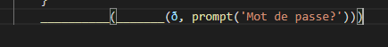 

<br>

Hai hàm được gọi là:
<br>
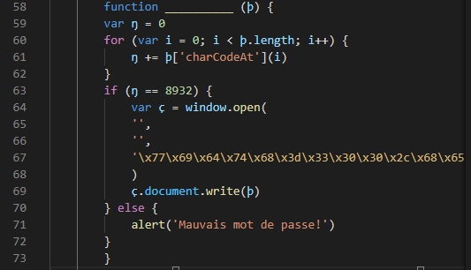 


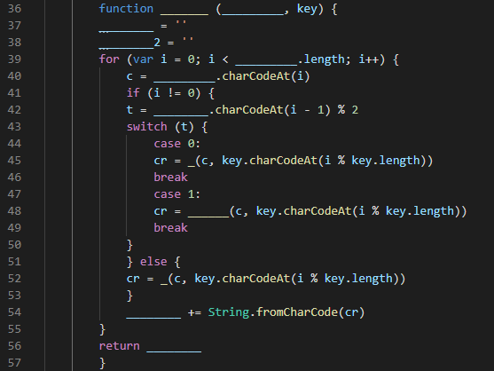 

<br>

Ban đầu hàm _______() được gọi truyền vào hai tham số là  `ð` và  `prompt('Mot de passe?') - input người dùng nhập vào`


Đọc sơ hàm ta thấy hàm duyệt qua tất cả kí tự của `ð` và nếu đó là kí tự đầu tiên thì sẽ được XOR với kí tự tương ứng chuỗi input người dùng nhập vào (key[i]), qua hàm fromCharCode và cộng dồn vào  ________ (dòng 54); ngược lại nếu không là kí tự đầu thì sẽ dựa vào tính chẵn lẻ của kí tự index liền trước ________ lấy CharCode, nếu chẵn sẽ tiến hành phép XOR đơn giản 2 kí tự tương ứng `ð` và `input`, nếu lẻ sẽ gọi tới hàm ______ thực hiện 1 loạt tính toán dài dòng khác.


Kết quả tiếp tục được truyền vào hàm __________, duyệt qua cả chuỗi truyền vào và tính tổng charCode các kí tư, nếu bằng  8932 thì hiện thông báo thành công, ngược lại hiện thông báo thất bại.

Liên tục liệt kê các key giá trị, tham khảo hint sử dụng bằng blasting có được 2 key giá trị thỏa mãn tổng kiểm tra đã phân tích phía trên bằng 8932 là: `+3` và `yasmin` 
 
Tiến hành nhập thử:

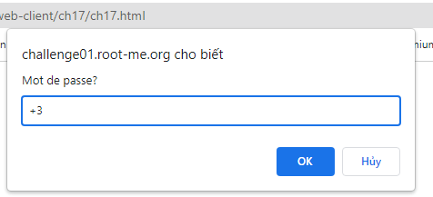 

<br><br>

Dựa vào hint ta cần enable popups 


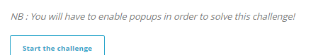 

Sau đó một popups hiện lên. Thử inspect ta thấy có vẻ hai khối màu vàng là một cặp thẻ đóng mở, bên trong chứa nội dung hiển thị lên popups. Dự đoán hai cặp thẻ đó có thể là `"<html></html>"`

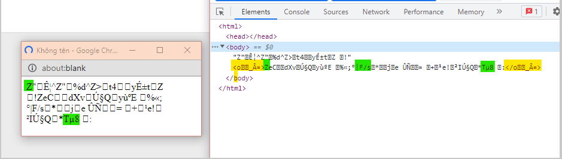 

<br>

Nhìn lại luồng challenge thì ta có thể dự đoán challenge yêu cầu nhập pass, gọi hàm ` __________(_______(ð, prompt('Mot de passe?')))` thực hiện giải mã `ð` với `key` là pass nhập vào, sau đó in ra plaintext nếu tổng kí tự ascii plaintext = 8932. Tuy nhiên có nhiều pass thỏa mãn nhưng sẽ chỉ có một pass cho ra plaintext có thể đọc được(có nghĩa).

Trở lại phân tích popups, Ở đây ta thử trường hợp đơn giản là các ký tự của pass (key)  khi XOR với ð phải là chẵn để hàm XOR được áp dụng trên cả chuỗi. Để ý khi thực hiện XOR là XOR `ð[i]` với charcode `key[i % key.length]`, trường hợp key ngắn hơn thì sẽ quay lại XOR từ đầu key.

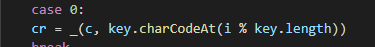 

Do vậy để tìm key thử lấy 6 kí tự đầu suy đoán từ plaintext `<html>` XOR với 6 ký tự đầu của `ð` ta được `“MyP4sS”`. 


<div style = "page-break-after: always;"></div>

<br>

Dùng password submit challenge. Thành công !

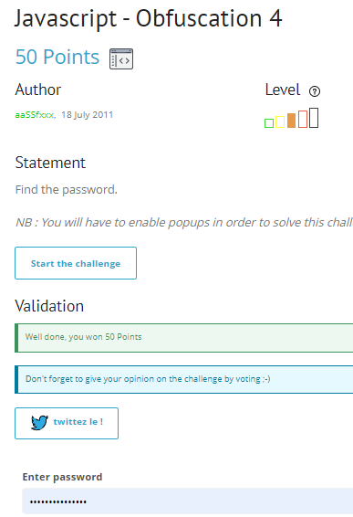

<br><br>

> **Flag:** MyP4sS