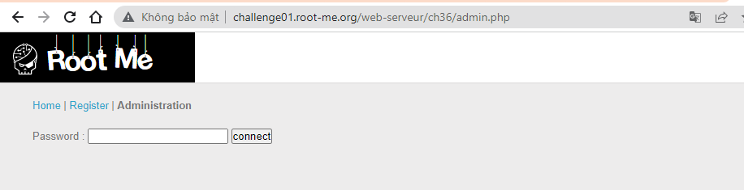
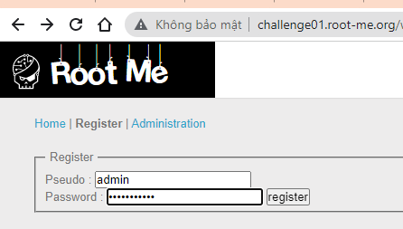
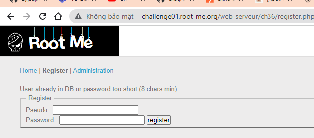
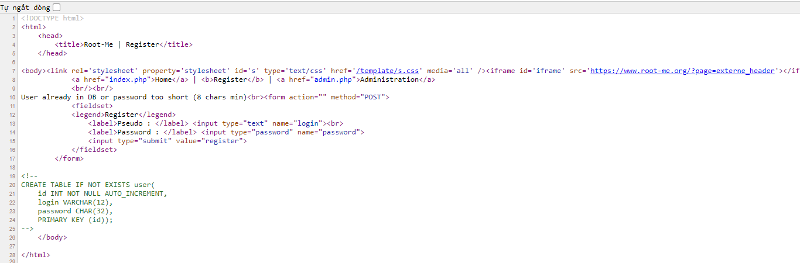
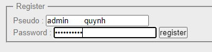
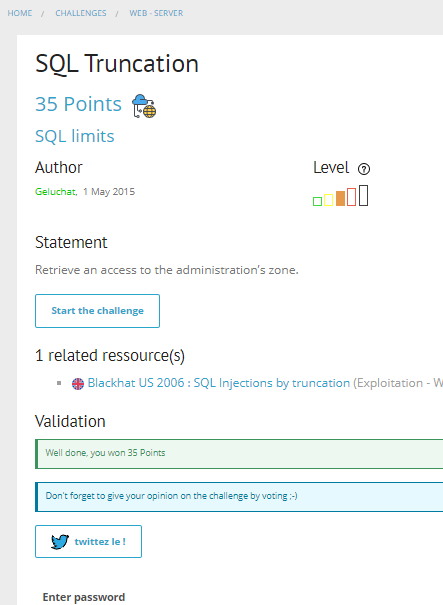

# Write up challenge SQL Truncation

Tác giả:
- **Nguyễn Mỹ Quỳnh**  

  
[Link Challenge](https://www.root-me.org/en/Challenges/Web-Server/SQL-Truncation) 
 

Truy cập challenge ta thấy gồm 3 trang Home | Register | Administration 

 

Mục tiêu chúng ta là có truy cập vào được admin zone. Để làm được ta cần có pass. Tiến hành đăng kí thử tài khoản admin:

 

Thông báo không thành công và ta biết được hai thông tin: một là tài khoản admin đã tồn tại, hai là độ dài mật khẩu cần lớn hơn hoặc bằng 8.

 

Như tên challenge đã gợi ý, tiến hành tìm hiểu SQL Truncation và biết được:
- Lỗ hổng SQL Truncation xảy ra khi độ dài input đầu vào không được validate. Khi độ dài chuỗi input nhập vào lớn hơn độ dài đã được define tương ứng thì nó sẽ bị cắt đi sao cho đúng bằng độ dài đã được define đó. 
- Một chú ý khác là trong quá trình so sánh MySQL sẽ bỏ qua các ký tự dấu cách ở cuối chuỗi. Nghĩa là `'admin'` sẽ bằng `'admin    ' `  
 

Ý tưởng sẽ là lợi dụng SQL Truncation để đăng kí tài khoản admin với thông tin mình cung cấp.

Tiến hành inspect thử ta thấy được definition table user: 

 

Ok, vậy là ta đã biết được trường login trong cơ sở dữ liệu được giới hạn tối đa 12 kí tự.

Tiến hành đăng kí với login là `'admin       quynh'` và pass `123456789` 

Như đã phân tích ở trên, khi kiểm tra  `'admin       quynh'` sẽ không trùng với login trong cơ sở dữ liệu nhưng khi dữ liệu được đưa vào database cột login sẽ cắt bớt và dữ liệu lúc này sẽ là `'admin       '` hay khi so sánh cũng là `'admin'`.
  Đăng kí thành công!

Tiến hành vào admin zone với pass `123456789` vừa đăng kí và có được flag.

Submit thành công 

  

> **Flag:** J41m3Qu4nD54Tr0nc
