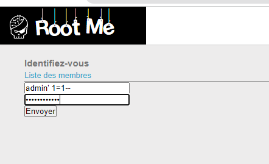
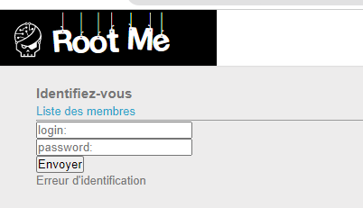
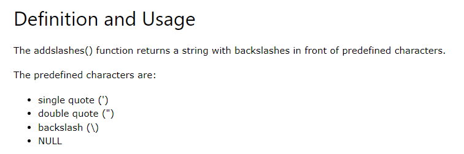
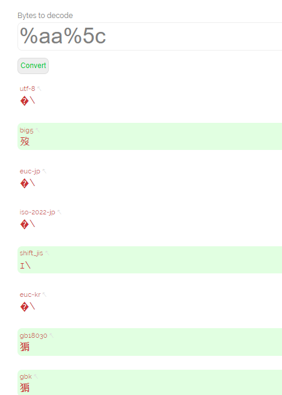
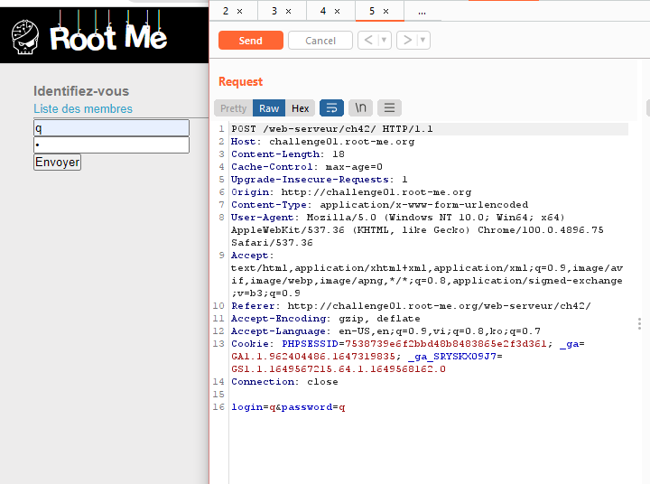
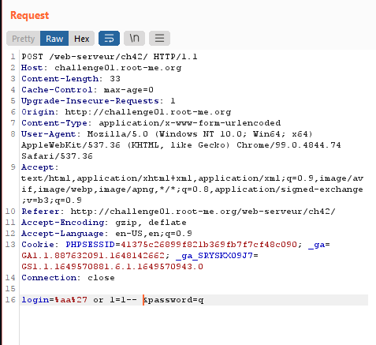
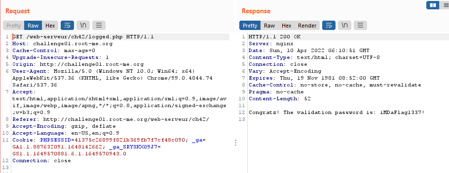

# Write up challenge SQL injection - Authentication - GBK

Tác giả:
- **Nguyễn Mỹ Quỳnh**  

  
[Link Challenge](https://www.root-me.org/en/Challenges/Web-Server/SQL-injection-authentication-GBK) 
 

Mục tiêu ta cần làm là nhận được quyền truy cập admin. Thử thực hiện attack:  

 

Thông báo không thành công. 

 

Để ý tên challenge và titile đã cho, sau khi đi tìm hiểu GBK, biết được đó dùng để mã hóa chuỗi tiếng Trung, dùng để bypass addslashes() Function.
  Về addslashes(), nó sẽ thêm kí tự `\` vào trước các kí tự đặc biệt như `'`. Đó là lí do dấu `'` của chúng ta chèn vào bị escape và attack không được. 

Từ đó ý tưởng là chúng ta chèn kí tự nào đó sao cho khi addslashes() Function thực thi xong thì kí tự `\` được thêm vào sẽ kết hợp với kí tự của chúng ta tạo thành một GBK hợp lệ.

  Ở đây mình sẽ chọn `%aa%5c`. Login cuối cùng sẽ là: `%aa%27 or 1=1--` và sau khi thực thi addlash sẽ thành `%aa%5c%27 or 1=1--` hay `猏' or 1=1--`

Dùng burpsuit sửa request 

Forward và nhận được flag:

Submit thành công 

  

> **Flag:** iMDaFlag1337!
