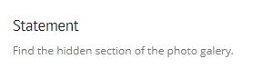
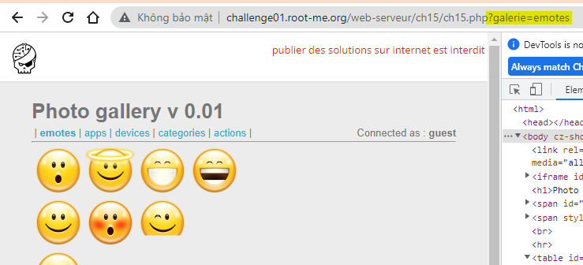
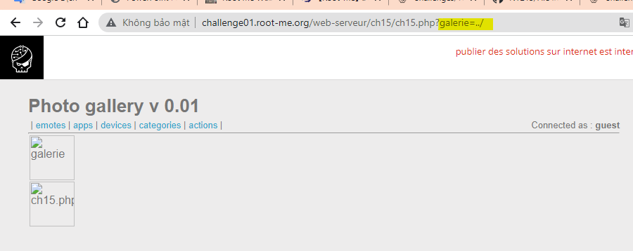
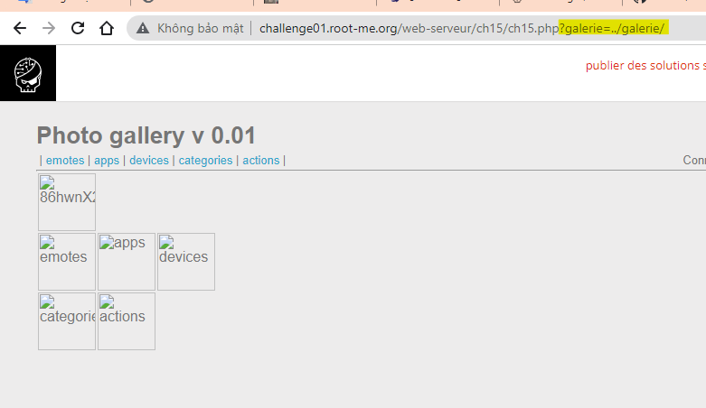
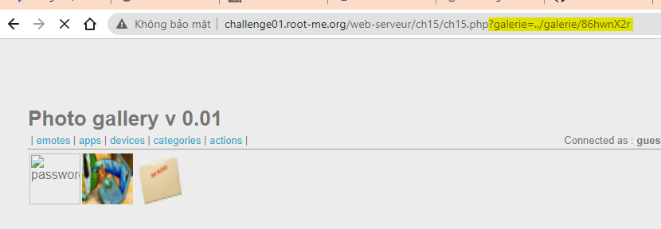
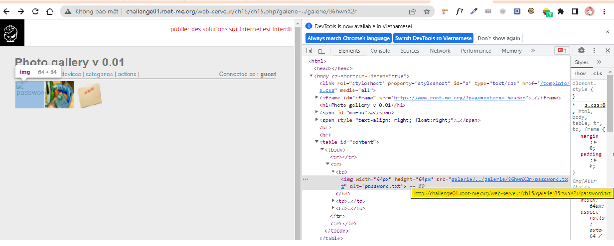
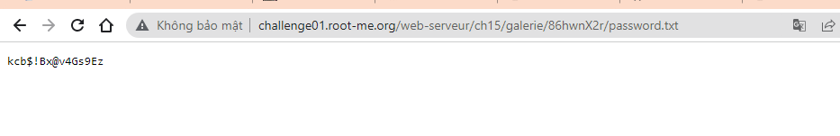
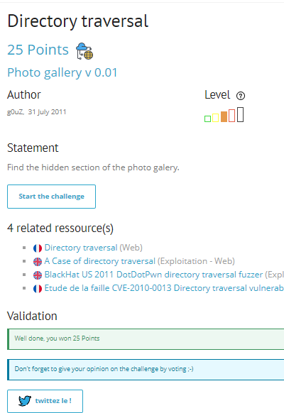

# Write up challenge Directory traversal

Tác giả:
- **Nguyễn Mỹ Quỳnh**  

  
[Link Challenge](https://www.root-me.org/en/Challenges/Web-Server/Directory-traversal) 
 

Hint đề bài tìm phần ẩn bộ ảnh

Truy cập challenge ta thấy có 5 tab   | emotes | apps | devices | categories | actions |

Bấm chọn từng tab thử thì ta thấy tương ứng với từng tab là thư mục chứa các file ảnh render lên cho người dùng xem, đồng thời ta thấy url thay đổi, có thêm tham số `?galerie=emotes`

Tiến hành thử một attack đơn giản: `http://challenge01.root-me.org/web-serveur/ch15/ch15.php?galerie=../`
  Thật vậy, có lỗi Local File Inclusion!

Ta thấy thư mục galerie, vào xem thử: `http://challenge01.root-me.org/web-serveur/ch15/ch15.php?galerie=../galerie/`

Ngoài các thư mục ban đầu ta thấy có thêm 1 thư mục là `86hwnX2r`. Ta Tiến hành vào xem thử, url tương ứng `http://challenge01.root-me.org/web-serveur/ch15/ch15.php?galerie=../galerie/86hwnX2r` thấy được một file khả nghi là password.txt.

Inspect thử ta tìm được url file password `http://challenge01.root-me.org/web-serveur/ch15/galerie/86hwnX2r/password.txt`

Tru cập url vừa tìm được thì nhận được flag.

Submit thành công! 

  

> **Flag:** kcb$!Bx@v4Gs9Ez