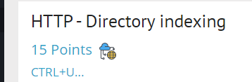
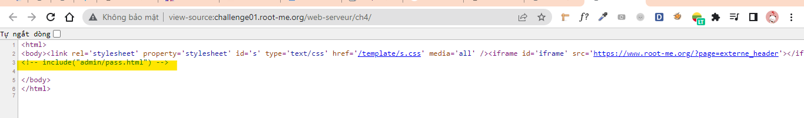
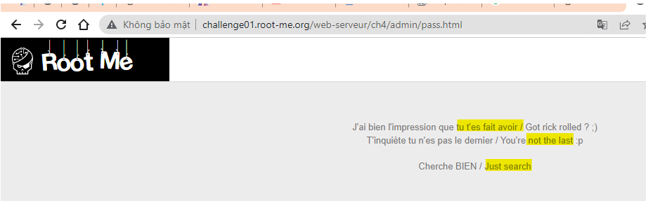
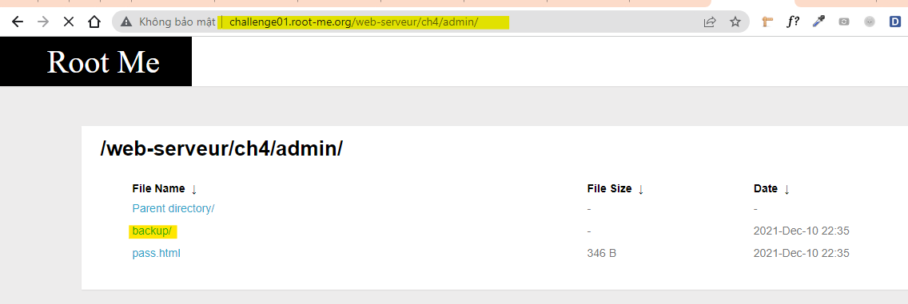
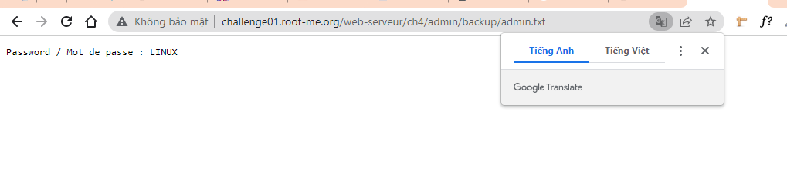
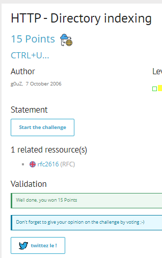

# Write up challenge HTTP - Directory indexing

Tác giả:
- **Nguyễn Mỹ Quỳnh**  

  
[Link Challenge](https://www.root-me.org/en/Challenges/Web-Server/HTTP-Directory-indexing) 
 

Truy cập challenge ta thấy có hint Ctr+U. Ta làm theo thử:

 

Ok đã thấy được đường dẫn  pass admin. Past thêm vào url xem sao:

Không có gì cả! 

Tuy nhiên xem ta thấy hint với các cụm từ `chỉ cần tìm kiếm`, `không phải cuối cùng`, `bị vặn` kết hợp với tên challenge có vẻ như cây thư mục có vẻ như gợi ý cho chúng ta tìm xung quanh. Làm thử thôi! Thử back ra admin nào:

Một thư mục backup! Có vẻ oke rồi. Vào xem thử!

Tiếp tục vào admin.txt:

Có được flag. 

Submit thành công 

  

> **Flag:** LINUX

