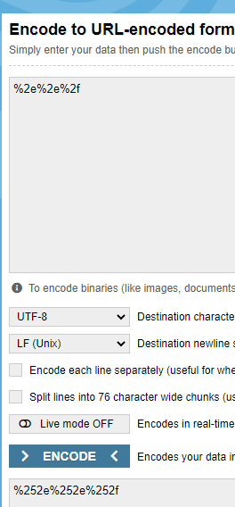

# Write up challenge Local File Inclusion - Double encoding

Tác giả:
- **Nguyễn Mỹ Quỳnh**  

  
[Link Challenge](https://www.root-me.org/en/Challenges/Web-Server/Local-File-Inclusion-Double-encoding) 
 

Để ý hint challenge yêu cầu tìm mật khẩu trong source files, tại đây ta có thể nghĩ ngay đến php-filters.
 Php-filters có thể được sử dụng để xem source files cục bộ máy chủ với output là base64 với cú pháp: `vuln.php?page=php://filter/convert.base64-encode/resource=filepath`

 Truy cập challenge ta thấy có 3 trang Home CV Contact với url thay đổi tương ứng mỗi khi nhấp vào từng trang:

 

Thử với basic attack:

Không thành công! Để ý tên challenge có đề cập đến double encode. OK thử bypass cơ chế detect bằng cách encode 2 lần 

 

Thành công vượt qua và ta từ lỗi nhận được ta biết được thêm code có dử dụng hàm include và tham số đầu vào sẽ tự động được nối với `.inc.php` vào phía sau.

Như đã phân tích ban đầu, thử áp dụng php-filters để xem source trang home:

        index.php?page=php://filter/convert.base64-encode/resource=home

Nhớ là encode 2 lần như đã phân tích, payload cuối cùng:

        index.php?page=php:%252f%252ffilter%252fconvert%252ebase64-encode%252fresource=home

Decode base64 output trang home vừa nhận được,ta thấy được nội dung trang home. Đọc code ta không thấy `user` và password đâu cả. Tuy nhiên để ý ta thấy có câu lệnh ` include("conf.inc.php");` ở phần đầu, có thể pass có ở đây.

 OK, bây giờ ta sẽ tiến hành áp dụng php-filters để xem source file conf.inc.php(chú ý hậu tố .inc.php sẽ tự động được thêm vào nên ta chỉ cần tên file là conf):

        index.php?page=php://filter/convert.base64-encode/resource=conf

Payload cuối cùng:

        index.php?page=php:%252f%252ffilter%252fconvert%252ebase64-encode%252fresource=conf

Đã thấy flag!

Submit flag thành công!

 

> **Flag:** Th1sIsTh3Fl4g!