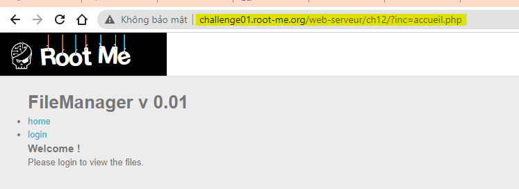
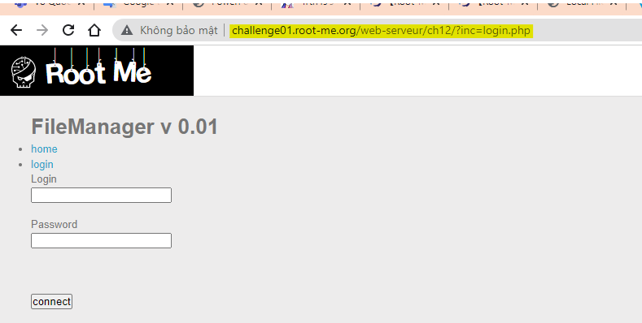
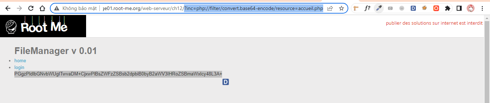
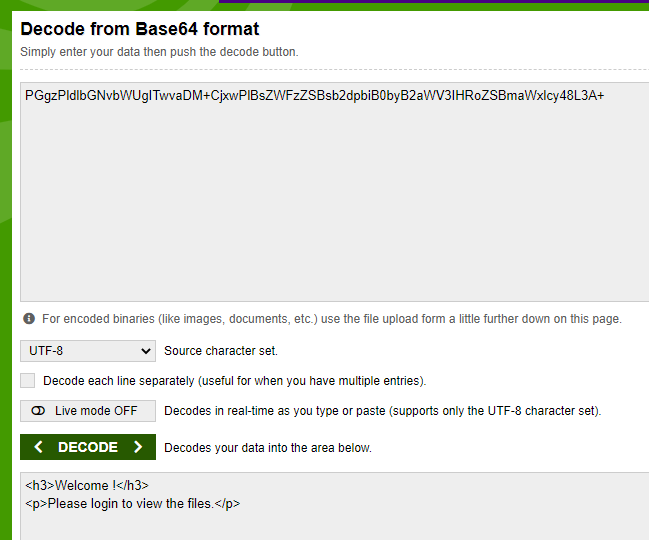
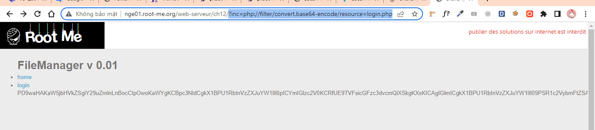
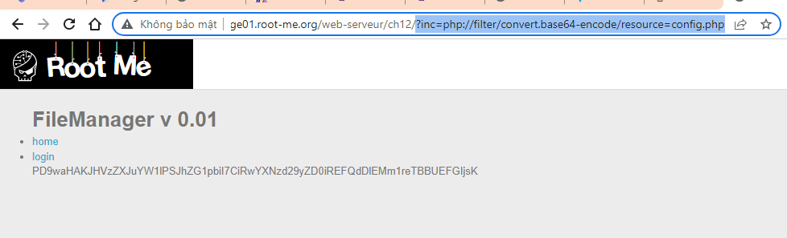
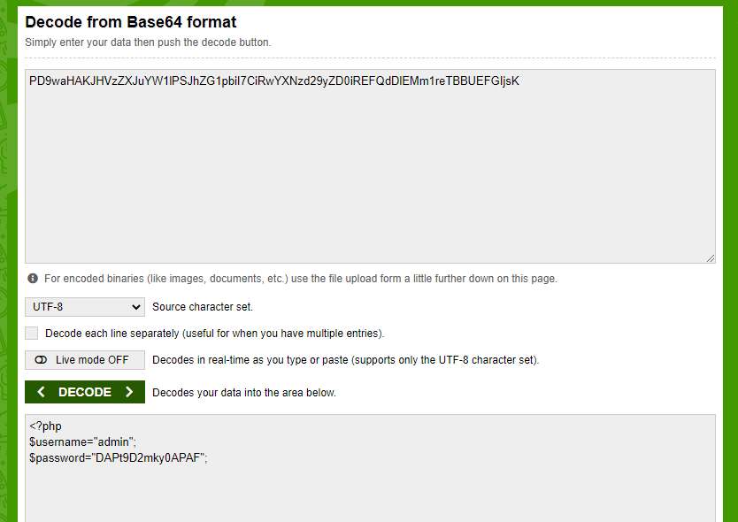
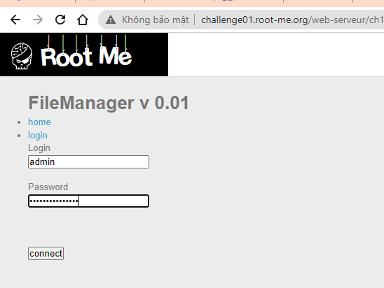
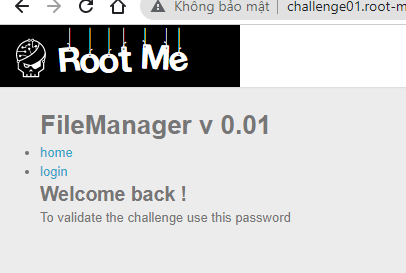
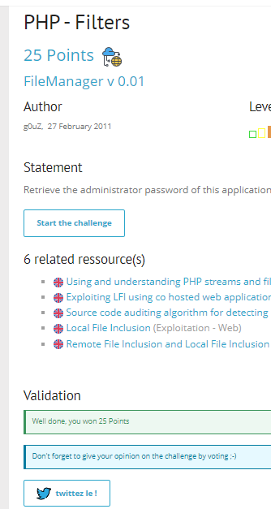

# Write up challenge PHP - Filters

Tác giả:
- **Nguyễn Mỹ Quỳnh**  

  
[Link Challenge](https://www.root-me.org/en/Challenges/Web-Server/PHP-Filters) 
 

Challenge yêu cầu tìm mật khẩu admin.

Truy cập challenge ta thấy có một trang home và một trang login với các url như sau:

 

Tên đề bài đã gợi ý quá rõ ràng là PHP - Filters, sau khi search tìm hiểu, em biết là php-filters có thể được sử dụng để xem source files cục bộ máy chủ với output là base64 với cú pháp: `vuln.php?page=php://filter/convert.base64-encode/resource=filepath`
 Từ url 2 trang trên thì ta có biết được 2 file là `accueil.php` và `login.php`. Tiến hành áp dụng php-filters để xem source 2 file này:
- accueil.php:

        ?inc=php://filter/convert.base64-encode/resource=accueil.php

Decode ta chưa tìm thấy thông tin gì quan trọng:

- Tiếp tục với file login.php:

        ?inc=php://filter/convert.base64-encode/resource=login.php  

Decode ta thấy được nội dung file login.php. Đọc code ta thấy `user` và `pass` người dùng nhập vào được so sánh với 2 biến `$username` và `$password`, tuy nhiên trong file này thì không thấy 2 biến đó được định nghĩa. Để ý ta thấy có câu lệnh `include("config.php");` ở phần đầu, có thể 2 biến này đã được định nghĩa ở đây.
 OK, bây giờ ta sẽ tiến hành áp dụng php-filters để xem source file config.php:

    ?inc=php://filter/convert.base64-encode/resource=config.php

 

Decode ta nhận được user và pass admin:

Sử dụng user và pass tìm được login tại trang login:

Login thành công! 

Dùng pass admin submit!

  

> **Flag:** DAPt9D2mky0APAF

