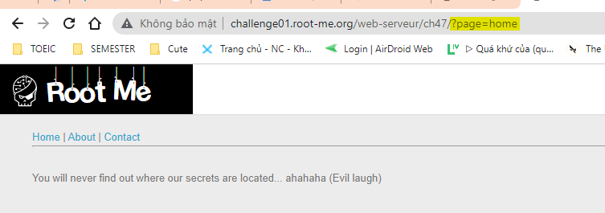
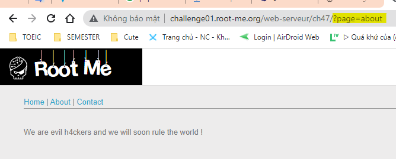
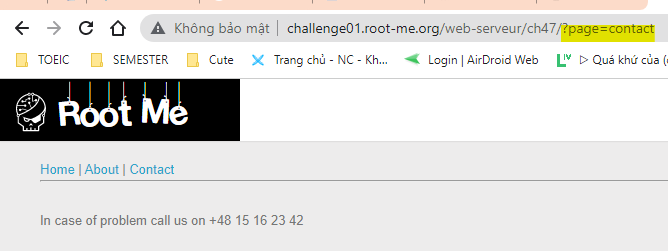
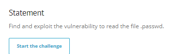
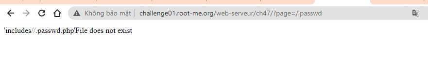
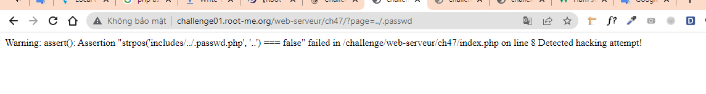
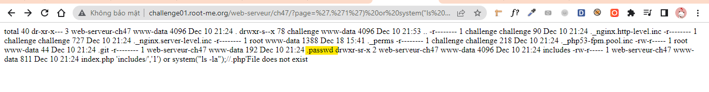
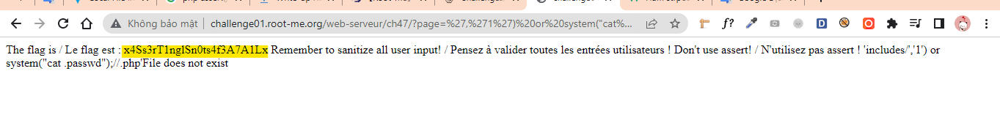
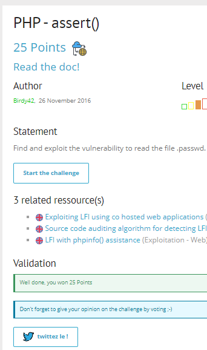

# Write up challenge PHP - assert()

Tác giả:
- **Nguyễn Mỹ Quỳnh**  

  
[Link Challenge](https://www.root-me.org/en/Challenges/Web-Server/PHP-assert) 
 

Truy cập challenge ta thấy có 3 trang Home | About | Contact và url thay đổi tương ứng khi nhập vào thông qua tham số `?page=` 

 

 

 

Yêu cầu là cần đọc được  file .passwd.

  

Thử thêm trực tiếp vào url `http://challenge01.root-me.org/web-serveur/ch47/?page=/.passwd` thì nhận được kết quả file không tồn tại tại đường dẫn hiện tại 

 

 

Thử back ra thư mục trước dùng payload `http://challenge01.root-me.org/web-serveur/ch47/?page=../.passwd`

 

 

Ta nhận được Warning: assert(): Assertion "strpos('includes/../.passwd.php', '..') === false". Từ đó ta có thể thấy được:
- `../.passwd.php` là đường dẫn mà ta vừa nhập vào url được nối với chuỗi `includes/` và dùng hàm `strpos` để tìm có tồn tại chuỗi con `'..'` trong đó không. Rõ rầng đây là cơ chế detect attack filter `..`
- Sau đó một hàm assert() được sử dùng. Có thể thấy nếu `strpos` trả về false thì sau khi qua hàm assert sẽ in ra chuỗi `Detected hacking attempt!`. Code kiểm tra có thể hình dung: `assert("strpos('includes/$file.php', '..') === false") or die("Detected hacking attempt!");`

Ok, đã hiểu được cơ chế ta tiến hành thử bypass dùng payload sau: `http://challenge01.root-me.org/web-serveur/ch47/?page=','1') or system("ls -la");//` Dấu // để comment đoạn code phía sau.

 Tuyệt vời! Đã thấy được file .passwrd. Tiến hành sửa command trong paylaij để đọc nội dung file .passwrd `http://challenge01.root-me.org/web-serveur/ch47/?page=','1') or system("cat .passwd");//`

Có được flag. Submit thành công 

  

> **Flag:** x4Ss3rT1nglSn0ts4f3A7A1Lx

